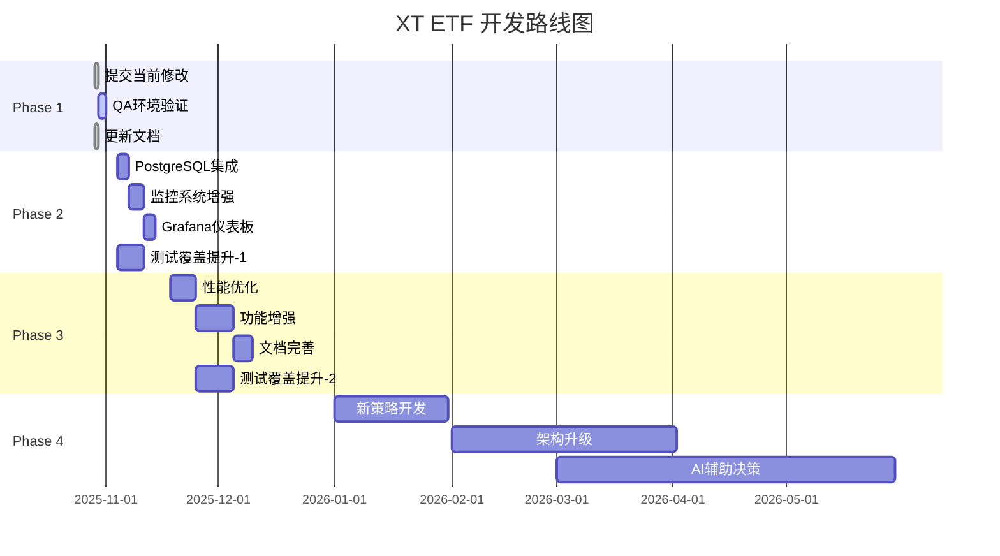

# 开发路线图

**文档版本**: v1.0
**更新日期**: 2025-10-29
**项目**: XT ETF Trading System

---

## 🎯 路线图概览

### 时间线
```
现在 (2025-10-29)
    │
    ├─► 立即行动（本周）
    │   ├─ 提交当前修改
    │   ├─ QA环境验证
    │   └─ 更新文档
    │
    ├─► 短期目标（1-2周）
    │   ├─ PostgreSQL集成
    │   ├─ 监控系统增强
    │   └─ 测试覆盖提升
    │
    ├─► 中期目标（1个月）
    │   ├─ 性能优化
    │   ├─ 功能增强
    │   └─ 文档完善
    │
    └─► 长期规划（3个月+）
        ├─ 新策略开发
        ├─ 系统架构升级
        └─ AI辅助决策
```

---

## 🚀 Phase 1: 立即行动（本周 - 2025-11-03）

### 目标
完成当前开发工作的收尾，确保代码安全和系统稳定

### 任务清单

#### 1.1 提交当前修改 ✅
**负责人**: 开发团队
**预计工时**: 1小时
**优先级**: 🔴 最高

**具体任务**:
- [x] 检查所有修改文件（7个）
- [x] 添加新文件到版本控制（2个）
- [x] 编写详细的commit message
- [x] 推送到远程分支

**验收标准**:
- ✅ 所有修改已提交
- ✅ Commit message清晰描述变更
- ✅ 远程分支与本地同步

**执行命令**:
```bash
# 查看状态
git status

# 添加新文件
git add etf/utils/logger.py test_stop_loss_fix.py

# 提交所有修改
git add -A
git commit -m "feat(risk+order): 动态Symbol配置和止损虚假触发修复

核心改进:
- 实施动态Symbol配置系统，解决ORDER_008精度错误
- 增强止损系统价格异常保护，防止虚假触发
- 新增统一日志配置系统（策略级别隔离）
- 支持QA2环境WebSocket连接
- 添加ton3l策略支持

影响范围: 7个文件，332行变更
测试: test_stop_loss_fix.py 验证通过"

# 推送
git push origin feature/etf-strategy-optimization
```

---

#### 1.2 QA环境完整验证 ⏳
**负责人**: QA + 开发团队
**预计工时**: 4小时
**优先级**: 🔴 最高

**测试场景**:

**场景1: 策略正常运行**
```bash
# 启动ton3l策略
python run_etf.py --strategy ton3l --env qa

# 预期结果
✅ 策略正常启动
✅ WebSocket连接成功（QA2环境）
✅ 风险监控正常工作
✅ 订单成功下单
```

**场景2: WebSocket稳定性**
```bash
# 监控WebSocket连接
tail -f logs/ton3l/ton3l.log | grep -i "websocket"

# 验证点
✅ 连接建立成功
✅ 深度数据正常接收
✅ 断线自动重连
✅ 5秒缓存生效
```

**场景3: 风险控制系统**
```bash
# 观察风险等级变化
tail -f logs/ton3l/ton3l.log | grep -i "risk"

# 验证点
✅ 风险等级实时计算
✅ Level 3时暂停交易
✅ 风险恢复后继续交易
```

**场景4: 止损系统**
```bash
# 运行止损测试
python test_stop_loss_fix.py

# 验证点
✅ 价格异常保护生效（15%/20%）
✅ 入场价计算正确
✅ 止损触发准确
✅ 冷却期生效（60分钟）
```

**场景5: 订单管理**
```bash
# 监控订单执行
tail -f logs/ton3l/ton3l.log | grep -i "order"

# 验证点
✅ Symbol配置自动加载
✅ 订单参数格式化正确
✅ 无ORDER_008错误
✅ 黑名单机制生效
✅ 熔断器正常工作
```

**验收标准**:
- [ ] 24小时运行无异常
- [ ] 订单成功率>95%
- [ ] 无虚假止损触发
- [ ] WebSocket连接稳定
- [ ] 风险控制正常工作

---

#### 1.3 更新项目文档 ✅
**负责人**: 技术文档团队
**预计工时**: 2小时
**优先级**: 🟡 高

**文档清单**:
- [x] `docs/PROJECT_PROGRESS_REPORT.md` - 项目进度报告
- [x] `docs/TECHNICAL_DEBT.md` - 技术债务跟踪
- [x] `docs/DEVELOPMENT_ROADMAP.md` - 开发路线图
- [ ] `CLAUDE.md` - 更新最新架构和功能

**CLAUDE.md更新内容**:
```markdown
## 最近更新 (2025-10-29)

### 核心改进
1. **动态Symbol配置系统**
   - 从交易所API自动获取精度配置
   - 解决ORDER_008精度错误
   - 订单金额自动调整（+20%余量）

2. **止损虚假触发修复**
   - 15%单次价格变化保护
   - 20%价格偏离保护
   - 入场价多重验证

3. **统一日志系统**
   - 策略级别日志隔离
   - 日志轮转（日期/大小）
   - 30天自动清理

4. **QA2环境支持**
   - WebSocket连接
   - ton3l策略测试
   - 独立配置管理

### 架构更新
- 风险控制系统集成到主循环
- WebSocket优先，REST降级策略
- 订单黑名单和熔断器机制

### 文档资源
- [项目进度报告](docs/PROJECT_PROGRESS_REPORT.md)
- [技术债务跟踪](docs/TECHNICAL_DEBT.md)
- [开发路线图](docs/DEVELOPMENT_ROADMAP.md)
```

**验收标准**:
- ✅ 所有文档创建完成
- [ ] CLAUDE.md更新完成
- [ ] 文档交叉引用正确
- [ ] Markdown格式正确

---

### Phase 1 成功标准
- ✅ 代码安全提交
- [ ] QA环境24小时无异常
- ✅ 文档与代码同步

---

## 📦 Phase 2: 短期目标（1-2周 - 2025-11-17）

### 目标
完善核心功能，提升系统稳定性和可观测性

### 2.1 订单记录器PostgreSQL集成

**负责人**: 后端开发团队
**预计工时**: 2-3天
**优先级**: 🔴 最高

**技术方案**: 详见 `docs/TECHNICAL_DEBT.md` 第1项

**子任务**:
- [ ] **Day 1-2**: 数据库设计和实现
  - [ ] 设计orders表结构
  - [ ] 实现异步批量写入
  - [ ] 添加重试机制
  - [ ] 单元测试覆盖

- [ ] **Day 3**: 数据迁移和验证
  - [ ] 编写CSV迁移脚本
  - [ ] 迁移历史数据
  - [ ] 性能测试（插入>1000条/秒）
  - [ ] 集成测试

**验收标准**:
- [ ] orders表创建成功
- [ ] 批量写入功能正常
- [ ] 失败自动降级到CSV
- [ ] 历史数据迁移完成
- [ ] 性能测试通过

**风险和缓解**:
| 风险 | 影响 | 缓解措施 |
|------|------|---------|
| PostgreSQL连接池耗尽 | 写入失败 | 配置连接池限制，实施排队机制 |
| 批量写入性能差 | 积压增加 | 优化批量大小，使用bulk_insert |
| 数据迁移失败 | 历史数据丢失 | 保留CSV备份，分批迁移 |

---

### 2.2 稳定性监控异步实现

**负责人**: 后端 + 运维团队
**预计工时**: 3-4天
**优先级**: 🔴 最高

**技术方案**: 详见 `docs/TECHNICAL_DEBT.md` 第2项

**子任务**:
- [ ] **Day 1-2**: 监控系统改造
  - [ ] 实现异步监控循环
  - [ ] API健康检查
  - [ ] WebSocket健康检查
  - [ ] 订单成功率监控
  - [ ] 系统资源监控

- [ ] **Day 3**: 告警系统集成
  - [ ] 配置告警规则
  - [ ] 集成通知渠道（钉钉/邮件）
  - [ ] 测试告警触发

- [ ] **Day 4**: 集成和测试
  - [ ] 集成到主循环
  - [ ] 24小时运行测试
  - [ ] 文档更新

**验收标准**:
- [ ] 异步监控正常运行
- [ ] 4个监控指标正常采集
- [ ] 告警规则生效
- [ ] 通知渠道畅通
- [ ] 24小时运行无异常

---

### 2.3 Grafana仪表板和告警

**负责人**: 运维团队
**预计工时**: 2-3天
**优先级**: 🟡 高

**子任务**:
- [ ] **Day 1**: 仪表板开发
  - [ ] 交易监控仪表板
  - [ ] 风险监控仪表板
  - [ ] 系统健康仪表板
  - [ ] 资源监控仪表板

- [ ] **Day 2**: 告警配置
  - [ ] 关键告警规则（6条）
  - [ ] 警告告警规则（4条）
  - [ ] 告警通知测试

- [ ] **Day 3**: 文档和培训
  - [ ] 仪表板使用文档
  - [ ] 告警处理流程
  - [ ] 团队培训

**验收标准**:
- [ ] 4个仪表板上线
- [ ] 10条告警规则生效
- [ ] 告警通知正常
- [ ] 团队完成培训

---

### 2.4 测试覆盖率提升（开始）

**负责人**: QA + 开发团队
**预计工时**: 持续2周
**优先级**: 🟡 高

**Week 1任务**:
- [ ] 核心交易流程测试（P0）
  - [ ] 完整交易周期测试
  - [ ] 风险控制集成测试
  - [ ] 止损执行测试

**Week 2任务**:
- [ ] WebSocket和数据流测试（P1）
  - [ ] WebSocket重连测试
  - [ ] 深度数据降级测试

**验收标准**:
- [ ] P0测试覆盖率100%
- [ ] P1测试覆盖率80%
- [ ] 所有测试通过

---

### Phase 2 成功标准
- [ ] PostgreSQL集成完成，性能达标
- [ ] 监控系统24小时运行无异常
- [ ] Grafana仪表板上线
- [ ] 测试覆盖率>60%

---

## 🎨 Phase 3: 中期目标（1个月 - 2025-12-29）

### 目标
优化系统性能，增强功能，完善文档

### 3.1 性能优化

**负责人**: 后端开发团队
**预计工时**: 5-7天
**优先级**: 🟡 高

**优化方向**:

**1. 订单批量处理优化**
- **当前**: 100条/批
- **目标**: 动态批量大小（50-200条）
- **收益**: 减少API调用次数，降低延迟

**实施**:
```python
class DynamicBatchManager:
    def __init__(self):
        self.batch_size = 100
        self.latency_window = deque(maxlen=100)

    def adjust_batch_size(self):
        """根据延迟动态调整批量大小"""
        avg_latency = sum(self.latency_window) / len(self.latency_window)

        if avg_latency < 0.05:  # 延迟低，增加批量
            self.batch_size = min(200, self.batch_size + 10)
        elif avg_latency > 0.2:  # 延迟高，减少批量
            self.batch_size = max(50, self.batch_size - 10)
```

**2. Symbol配置缓存优化**
- **当前**: 1小时固定刷新
- **目标**: 可配置刷新间隔
- **收益**: 灵活的配置更新策略

**3. WebSocket重连策略优化**
- **当前**: 指数退避，最大60秒
- **目标**: 智能重连（基于历史成功率）
- **收益**: 更快的连接恢复

**4. 内存使用优化**
- 清理无用的历史数据
- 优化数据结构
- 实施对象池
- **目标**: 内存使用<500MB

**验收标准**:
- [ ] 订单处理延迟<100ms（P95）
- [ ] 内存使用<500MB
- [ ] CPU使用<20%（正常运行）
- [ ] 性能测试报告完成

---

### 3.2 功能增强

**负责人**: 产品 + 开发团队
**预计工时**: 7-10天
**优先级**: 🟡 高

**功能1: 动态参数调整API** (3天)
- HTTP API接口
- 参数热更新
- 参数验证
- 审计日志

**功能2: 策略PnL实时计算** (2天)
- 实时盈亏计算
- 未实现/已实现盈亏分离
- PnL趋势图表

**功能3: 高级监控指标** (2天)
- 刷量/真实交易比例
- 订单成功率趋势
- 资金使用效率

**功能4: 自动化报告生成** (3天)
- 每日策略报告
- 周度性能分析
- 月度总结报告

**验收标准**:
- [ ] 4个新功能上线
- [ ] API文档完整
- [ ] 集成测试通过
- [ ] 用户反馈良好

---

### 3.3 文档完善

**负责人**: 技术文档团队
**预计工时**: 3-5天
**优先级**: 🟡 高

**文档清单**:

**1. API Reference** (2天)
- 所有公开接口文档
- 请求/响应示例
- 错误码说明
- 使用场景

**2. 运维手册** (2天)
- 部署流程
- 监控指标说明
- 故障排查指南
- 常见问题FAQ

**3. 架构设计文档** (1天)
- 系统架构图
- 数据流图
- 关键设计决策
- 扩展指南

**验收标准**:
- [ ] 3份文档完成
- [ ] 格式统一（Markdown）
- [ ] 图表清晰（Mermaid）
- [ ] 团队评审通过

---

### 3.4 测试覆盖率提升（完成）

**负责人**: QA + 开发团队
**预计工时**: 持续2周
**优先级**: 🟡 高

**Week 3任务**:
- [ ] 订单管理测试（P2）
  - [ ] 订单验证测试
  - [ ] 熔断器测试
  - [ ] 黑名单测试

**Week 4任务**:
- [ ] 压力测试和边界测试
  - [ ] 高并发场景
  - [ ] 极端市场条件
  - [ ] 资源限制场景

**验收标准**:
- [ ] 总体覆盖率>80%
- [ ] 所有P0/P1/P2测试通过
- [ ] 压力测试基准建立

---

### Phase 3 成功标准
- [ ] 性能指标达标
- [ ] 4个新功能上线
- [ ] 3份文档完成
- [ ] 测试覆盖率>80%

---

## 🚀 Phase 4: 长期规划（3个月+ - 2026-03+）

### 目标
探索新技术，开发新策略，提升系统能力

### 4.1 新策略开发

**潜在策略**:
- **stg7l/stg7s**: 7x杠杆策略（更激进）
- **adaptive**: 自适应策略（动态调整参数）
- **arbitrage**: 跨交易所套利
- **multi-asset**: 多币种组合策略

**评估标准**:
- 回测收益率
- 最大回撤
- 夏普比率
- 风险调整收益

---

### 4.2 系统架构升级

**方向1: 微服务架构**
- 拆分策略服务
- 独立风控服务
- 统一网关
- 服务发现和注册

**方向2: 事件驱动架构**
- Kafka消息队列
- 事件溯源
- CQRS模式
- 实时流处理

**方向3: 云原生部署**
- Kubernetes编排
- 容器化部署
- 自动扩缩容
- 灰度发布

---

### 4.3 AI辅助决策

**应用场景**:
- **市场状态识别**: 趋势/震荡/反转
- **参数优化**: 强化学习自动调参
- **风险预测**: 机器学习风险评分
- **异常检测**: 自动识别异常交易模式

**技术栈**:
- TensorFlow/PyTorch
- 时间序列分析
- 强化学习（RL）
- 深度学习（LSTM/Transformer）

---

### Phase 4 成功标准
- [ ] 至少1个新策略上线
- [ ] 架构升级方案确定
- [ ] AI辅助决策POC完成

---

## 📊 里程碑时间线



---

## 🎯 关键绩效指标（KPI）

### 技术指标
| 指标 | 当前 | Phase 2 | Phase 3 | Phase 4 |
|------|------|---------|---------|---------|
| **订单成功率** | 95% | 98% | 99% | 99.5% |
| **订单延迟（P95）** | 150ms | 100ms | 80ms | 50ms |
| **测试覆盖率** | 50% | 60% | 80% | 90% |
| **系统可用性** | 99% | 99.5% | 99.9% | 99.95% |
| **内存使用** | ~600MB | <500MB | <400MB | <300MB |

### 业务指标
| 指标 | 当前 | Phase 2 | Phase 3 | Phase 4 |
|------|------|---------|---------|---------|
| **活跃策略数** | 4 | 4 | 5 | 8+ |
| **日均交易量** | - | - | - | - |
| **策略盈利率** | - | - | - | - |
| **风险事件** | 0 | 0 | 0 | 0 |

---

## 📝 更新日志

### 2025-10-29
- 创建开发路线图
- 定义Phase 1-4目标
- 设定KPI指标

### (待更新)
- 记录实际进度
- 调整计划
- 更新里程碑

---

## 🤝 团队分工

### 开发团队
- **核心开发**: PostgreSQL集成, 监控系统, 功能增强
- **性能优化**: 批量处理, 缓存策略, 资源优化
- **代码审查**: 持续代码质量保障

### QA团队
- **测试开发**: 集成测试, E2E测试
- **压力测试**: 性能基准, 边界测试
- **质量把关**: 测试覆盖率, 缺陷管理

### 运维团队
- **监控运维**: Grafana仪表板, 告警配置
- **部署管理**: 生产环境部署, 故障恢复
- **文档维护**: 运维手册, 故障排查指南

### 产品团队
- **需求管理**: 新功能需求, 优先级排序
- **用户反馈**: 收集用户意见, 策略优化建议
- **数据分析**: 策略性能分析, 业务指标跟踪

---

**文档结束**

如需调整路线图，请更新本文档并同步更新"更新日志"部分。
