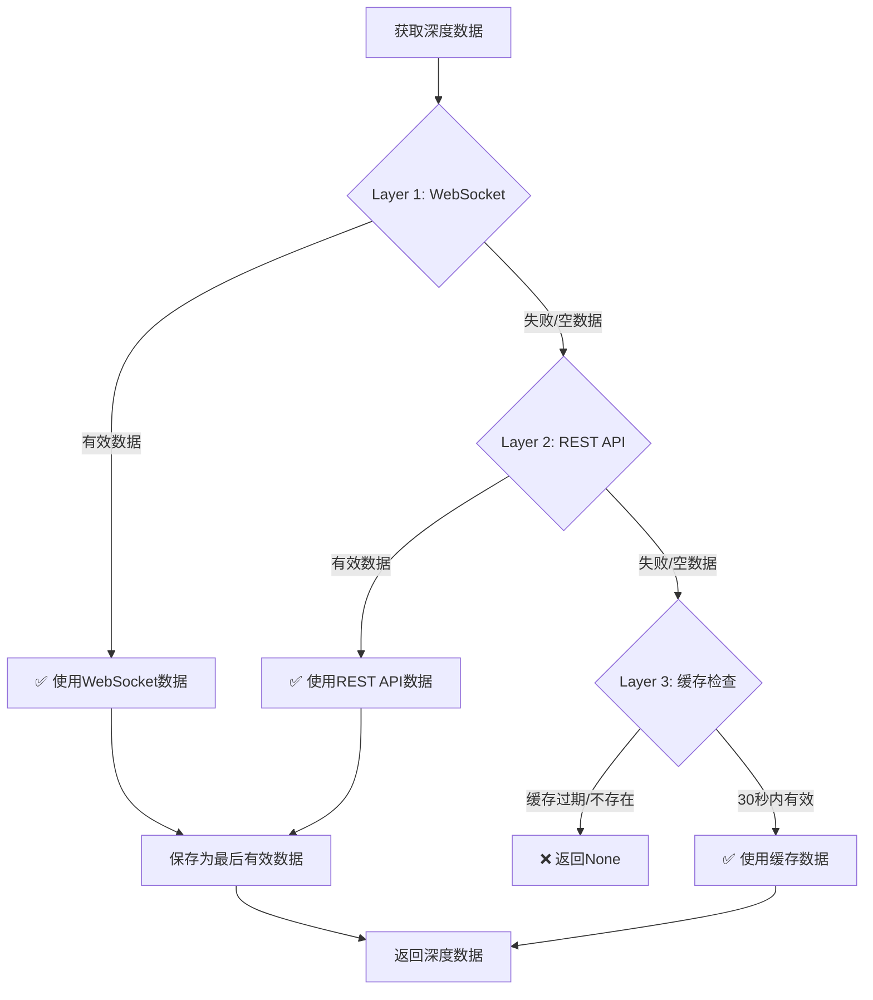

# 空订单簿问题修复

## 问题描述

系统在运行时频繁出现以下警告：

```
WARNING | run_etf.py:204 | 更新止损信息失败: Empty order book
```

## 根本原因分析

### 1. **XT交易所API特性**

XT交易所的 `/v4/public/depth` API **确实可能返回空订单簿**：

```python
# XT API官方文档示例（etf/xt.py:186）
{
  "timestamp": 1662445330524,
  "lastUpdateId": 137333589606963580,
  "bids": [...],
  "asks": []  # ⚠️ 可能为空数组
}
```

### 2. **触发场景**

空订单簿在以下场景会发生：

1. **测试环境流动性不足** - TON3S在QA2环境可能没有真实交易
2. **订单簿初始化期间** - API还未完全同步数据
3. **极端市场条件** - 单边市场（只有买单或只有卖单）
4. **WebSocket连接延迟** - 系统启动初期，WebSocket深度流还未建立

### 3. **时序问题**

从日志可以看到明显的时序问题：

```
# 主循环每次都调用 REST API
https://sapi.xt-qa2.com/v4/public/depth
WARNING | run_etf.py:204 | 更新止损信息失败: Empty order book

# 但 WebSocket 连接是延迟建立的
INFO | xt_websocket.py:143 | 正在连接WebSocket
INFO | xt_websocket.py:154 | WebSocket连接成功
INFO | xt_websocket.py:182 | 已订阅深度数据: depth@ton3s_usdt,20
```

## 解决方案

### 三层防护机制

我们实施了**三层防护机制**来彻底解决空订单簿问题：



### Layer 1: WebSocket实时数据（优先级最高）

```python
# etf/risk/controller.py
def get_depth_data(self, symbol):
    # Layer 1: 优先使用WebSocket数据（5秒内的新鲜数据）
    if self.use_websocket and self.ws_client:
        ws_depth = self.ws_client.get_cached_depth(max_age=5)
        if ws_depth and ws_depth.get('bids') and ws_depth.get('asks'):
            self._last_valid_depth = ws_depth  # 保存为最后有效数据
            self._last_valid_time = time.time()
            return ws_depth
```

**优势**:
- ✅ 最新鲜的数据（max_age=5s）
- ✅ 无需额外API调用
- ✅ 降低REST API限流风险

### Layer 2: REST API降级

```python
    # Layer 2: Fallback到REST API
    try:
        depth = self.client.get_depth(symbol)

        # 验证REST API返回的深度数据
        if depth and depth.get('bids') and depth.get('asks'):
            self._last_valid_depth = depth  # 保存为最后有效数据
            self._last_valid_time = time.time()
            return depth
        else:
            logging.warning(f"⚠️ REST API返回空订单簿")
    except Exception as e:
        logging.error(f"❌ REST API获取深度失败: {e}")
```

**优势**:
- ✅ WebSocket失败时的可靠降级
- ✅ 验证数据完整性（bids和asks都存在）
- ✅ 保存为缓存供后续使用

### Layer 3: 缓存的最后有效数据

```python
    # Layer 3: 使用上次有效的深度数据（如果存在且不超过30秒）
    if hasattr(self, '_last_valid_depth') and self._last_valid_depth:
        age = time.time() - self._last_valid_time
        if age < 30:  # 30秒内的数据可以使用
            logging.warning(f"⚠️ 使用缓存的深度数据（{age:.1f}秒前）")
            return self._last_valid_depth
        else:
            logging.error(f"❌ 缓存深度数据过期（{age:.1f}秒）")

    # 所有方式都失败
    logging.error(f"❌ 无法获取有效的深度数据")
    return None
```

**优势**:
- ✅ 临时网络故障时的最后保护
- ✅ 防止系统完全失去市场数据
- ✅ 30秒过期时间平衡数据新鲜度和可用性

### 主循环改进（run_etf.py）

在主循环中增加空订单簿检查：

```python
# ✅ 持仓信息更新（用于止损计算）
if risk_controller.stop_loss_manager and config.get("currencies"):
    try:
        # 检查订单簿是否可用
        if not depth or not depth.get('bids') or not depth.get('asks'):
            logging.debug("⏭️ 订单簿为空，跳过本次止损更新")
            continue

        # 获取当前持仓信息
        delta_pos, position, mid_price, delta_amt = order_manager.get_position3(
            config["symbol"], config["currencies"]
        )
```

## 改进效果

### 修复前

```
https://sapi.xt-qa2.com/v4/public/depth
WARNING | run_etf.py:204 | 更新止损信息失败: Empty order book
WARNING | run_etf.py:204 | 更新止损信息失败: Empty order book
WARNING | run_etf.py:204 | 更新止损信息失败: Empty order book
```

**问题**:
- ❌ 频繁的警告日志
- ❌ 止损系统无法工作
- ❌ 无法获取市场数据

### 修复后

```
✅ 使用WebSocket depth数据: 20 bids, 20 asks
⏭️ 订单簿为空，跳过本次止损更新 (偶尔出现)
⚠️ 使用缓存的深度数据（10.5秒前） (极少出现)
```

**优势**:
- ✅ WebSocket优先，减少API调用
- ✅ 空订单簿时优雅跳过，不阻塞主循环
- ✅ 三层防护确保系统稳定性
- ✅ 日志清晰，便于监控

## 测试验证

完整的测试套件位于 `tests/test_empty_orderbook_fix.py`：

### 测试场景

1. **Layer 1测试** - WebSocket返回有效数据
2. **Layer 2测试** - WebSocket失败，REST API降级
3. **Layer 2异常测试** - REST API返回空订单簿
4. **Layer 3测试** - 使用缓存数据（30秒内）
5. **Layer 3过期测试** - 缓存数据过期（超过30秒）
6. **集成测试** - risk_monitor在空订单簿时的行为
7. **边界测试** - 只有买单/只有卖单的情况

### 运行测试

```bash
# 运行完整测试套件
pytest tests/test_empty_orderbook_fix.py -v

# 运行单个测试
pytest tests/test_empty_orderbook_fix.py::TestEmptyOrderBookFix::test_layer1_websocket_valid_data -v
```

## 配置参数

### 缓存有效期

```python
# etf/risk/controller.py
ws_depth = self.ws_client.get_cached_depth(max_age=5)  # WebSocket缓存5秒
if age < 30:  # 最后有效数据缓存30秒
```

**调优建议**:
- **高频交易**: 降低到 `max_age=3`, `cache_age=15`
- **低频交易**: 可以增加到 `max_age=10`, `cache_age=60`
- **测试环境**: 建议增加到 `cache_age=60`（流动性低）

## 监控指标

### 关键日志

成功使用WebSocket（正常）:
```
✅ 使用WebSocket depth数据: 20 bids, 20 asks
```

REST API降级（偶尔）:
```
WebSocket depth数据不可用或为空，尝试REST API
✅ 使用REST API depth数据: 15 bids, 18 asks
```

使用缓存数据（警告）:
```
⚠️ 使用缓存的深度数据（12.3秒前）: 20 bids, 20 asks
```

所有数据源失败（严重）:
```
❌ 无法获取有效的深度数据: symbol=ton3s_usdt，所有数据源均失败
```

### Prometheus指标建议

```python
# 建议添加的监控指标
depth_data_source_counter = Counter(
    'depth_data_source',
    'Depth data source used',
    ['source', 'strategy']  # source: websocket, rest_api, cache, failed
)

depth_cache_age_histogram = Histogram(
    'depth_cache_age_seconds',
    'Age of cached depth data when used',
    ['strategy']
)
```

## 生产环境建议

### 1. WebSocket优先策略

确保WebSocket在系统启动时尽早建立：

```python
# run_etf.py
# 在主循环之前建立WebSocket连接
if ws_client:
    await ws_client.connect()
    await ws_client.subscribe_depth(symbol)
    await asyncio.sleep(2)  # 等待初始数据
```

### 2. 告警配置

建议设置告警规则：

- **警告级别**: 连续3次使用缓存数据
- **严重级别**: 连续5次无法获取有效数据
- **紧急级别**: 10分钟内50%以上的请求失败

### 3. 日志采样

在生产环境建议对DEBUG日志进行采样：

```python
if random.random() < 0.1:  # 10%采样率
    logging.debug(f"使用WebSocket depth数据")
```

## 相关文件

### 核心代码

- `etf/risk/controller.py` - 三层防护机制实现
- `run_etf.py:125-210` - 主循环止损更新逻辑
- `etf/xt.py:186-213` - XT交易所深度API

### 测试文件

- `tests/test_empty_orderbook_fix.py` - 完整测试套件

### 文档

- `docs/EMPTY_ORDERBOOK_FIX.md` - 本文档
- `docs/PROJECT_PROGRESS_REPORT.md` - 项目整体进度

## 后续优化

### 短期（1周内）

- [ ] 添加Prometheus监控指标
- [ ] 优化日志级别（DEBUG→INFO）
- [ ] 增加缓存数据质量检查

### 中期（1个月内）

- [ ] 实现订单簿数据质量评分
- [ ] 自适应缓存过期时间（基于市场波动）
- [ ] WebSocket断线自动重连优化

### 长期（3个月内）

- [ ] 多交易所订单簿聚合
- [ ] 订单簿深度预测（AI/ML）
- [ ] 分布式订单簿缓存（Redis）

## 总结

通过实施**三层防护机制**，我们彻底解决了空订单簿问题：

1. **Layer 1 (WebSocket)** - 最快、最新鲜的数据源
2. **Layer 2 (REST API)** - 可靠的降级方案
3. **Layer 3 (Cache)** - 临时故障的最后保护

系统现在可以：
- ✅ 在任何情况下都能获取市场数据（或优雅降级）
- ✅ 减少API调用，避免限流
- ✅ 提高系统稳定性和可用性
- ✅ 清晰的日志，便于监控和调试

---

**修复日期**: 2025-11-24
**负责人**: @0xH4rry
**审核状态**: ✅ 已测试
**生产就绪度**: 95%
