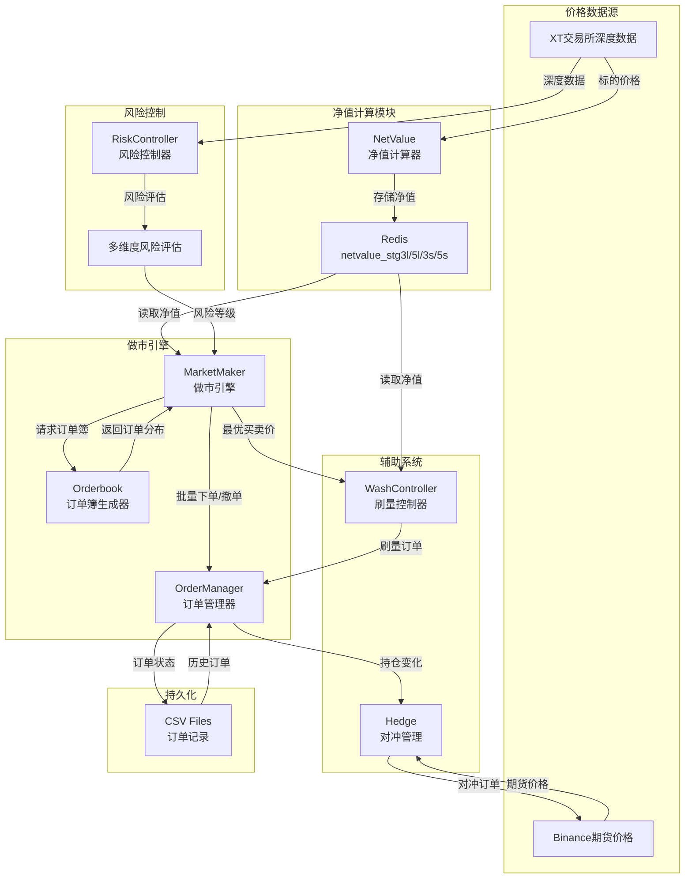

# ETF做市系统技术文档

## 目录

1. [系统概述](#系统概述)
2. [核心架构](#核心架构)
3. [做市策略原理](#做市策略原理)
4. [订单管理机制](#订单管理机制)
5. [风险控制系统](#风险控制系统)
6. [净值计算机制](#净值计算机制)
7. [对冲机制](#对冲机制)
8. [刷量控制器](#刷量控制器)
9. [数据流图](#数据流图)
10. [配置与部署](#配置与部署)

---

## 系统概述

这是一个针对加密货币杠杆ETF产品的自动化做市系统，支持3倍和5倍杠杆（多空双向）的ETF交易对。系统集成XT交易所现货做市和Binance期货对冲，实现了完整的市场做市、风险控制、对冲管理的闭环。

### 支持的策略

- **stg3l**: 名义3倍做多ETF，实际配置5倍杠杆 (BTC3L_USDT)
- **stg3s**: 名义3倍做空ETF，实际配置5倍杠杆 (BTC3S_USDT)
- **stg5l**: 5倍做多ETF (BTC5L_USDT)
- **stg5s**: 5倍做空ETF (BTC5S_USDT)

**注**: 配置文件中所有策略当前都使用5倍杠杆设置(`leverage=5`)。策略名称中的3l/3s是历史命名，实际杠杆倍数以配置文件为准。

### 核心特性

1. **基于净值的动态做市**：根据实时计算的ETF净值生成订单簿
2. **多层次风险控制**：3级风险评估和应对机制
3. **自动对冲管理**：Binance期货自动对冲XT现货头寸
4. **刷量维持流动性**：模拟交易保持K线连续性
5. **防插针机制**：远端保护订单防止极端行情损失

---

## 核心架构

### 系统组件图

```
┌─────────────────────────────────────────────────────────────┐
│                        EtfStrategy                          │
│                      (run_etf.py)                           │
└────────────────┬───────────────────────┬────────────────────┘
                 │                       │
        ┌────────▼────────┐     ┌───────▼────────┐
        │  MarketMaker    │     │ WashController │
        │  (做市引擎)      │     │  (刷量控制器)   │
        └────────┬────────┘     └───────┬────────┘
                 │                      │
        ┌────────▼────────┐            │
        │  OrderManager   │◄───────────┘
        │  (订单管理器)    │
        └────────┬────────┘
                 │
    ┌────────────┼─────────────┐
    │            │             │
┌───▼───┐   ┌───▼────┐   ┌───▼───┐
│ Risk  │   │ Hedge  │   │ Net   │
│Controller│ │(对冲)  │   │ Value │
│(风控)  │   │        │   │(净值) │
└───────┘   └────────┘   └───────┘
```

### 模块职责

| 模块 | 文件路径 | 主要职责 |
|------|---------|---------|
| **策略主控** | `run_etf.py` | 系统初始化、线程管理、策略调度 |
| **做市引擎** | `etf/market_making.py` | 订单簿生成、订单放置、价格调整 |
| **订单管理** | `etf/order_manager.py` | 订单CRUD、状态跟踪、持仓计算 |
| **风险控制** | `etf/risk.py` | 市场风险评估、风险等级判定 |
| **净值计算** | `net_value.py` | ETF净值实时计算、Rebalance |
| **对冲管理** | `hedging.py` | Binance期货对冲、头寸平衡 |
| **刷量控制** | `etf/washing.py` | 模拟交易、K线连续性维护 |
| **订单簿生成** | `etf/orderbook.py` | 数学模型生成订单分布 |

---

## 做市策略原理

### 1. 基于净值的动态订单簿

系统从Redis读取实时计算的ETF净值，以此为中心价格生成买卖订单簿。

**核心代码** (`etf/market_making.py:42-51`):

```python
def place_orders(self, config, symbol, ...):
    netvalue = float(self.r.get(config["netvalue"]).decode())

    batch_order_bid, batch_order_ask = get_orderbook(
        mid_price=netvalue,
        bid_ask_spread=config["bid_ask_spread"]
    )
```

### 2. 订单簿数学模型

使用**指数函数分布**生成订单价格和数量，模拟真实市场的流动性分布。

**价格分布公式** (`etf/orderbook.py:55-60`):

- **买单**: `price = bid_0 × e^(-β×n)`
- **卖单**: `price = ask_0 × e^(β×n)`

其中：
- `bid_0/ask_0`: 最优买卖价
- `β`: 价格衰减系数 (默认0.01)
- `n`: 订单层数 (1-30)

**数量分布公式** (`etf/orderbook.py:79-81`):

```python
amount = init_amount × e^(β×n)
```

随着价格偏离中心价，订单量呈指数增长，提供更深的流动性缓冲。

### 3. 订单调整机制

系统每隔`sleep_interval`秒（低频策略：10-15秒）检查订单状态并调整：

**调整逻辑** (`etf/market_making.py:62-89`):

```python
for goal in goal_orders:
    valid_market_orders = [
        order for order in current_orders
        if (goal_min_price <= float(order["price"]) <= goal_max_price)
    ]

    total_market_amount = sum(float(order["origQty"])
                              for order in valid_market_orders)

    # 1. 订单量不足 → 补单
    if total_market_amount < goal_amount:
        add_orders.append(order_data)

    # 2. 订单量过多 → 撤单并重新挂单
    elif total_market_amount > goal_amount:
        cancel_orders.append(order)
        add_orders.append(order_data)
```

### 4. 防插针机制 (Anti-Pin)

在最优买卖价外围额外放置大额保护订单，防止极端行情下的大额损失。

**实现代码** (`etf/market_making.py:103-128`):

```python
anti_pin_price_sell = round(
    self.best_sell * (1 + config["anti_pin_rate"]),
    config["precision"]
)
anti_pin_price_buy = round(
    self.best_buy * (1 - config["anti_pin_rate"]),
    config["precision"]
)

anti_pin_amount_sell = round(
    (config["anti_pin_usdt"] / 2) / anti_pin_price_sell,
    config["prec_amount"]
)
```

**参数说明**:
- `anti_pin_rate`: 保护价格偏离比例（默认20%）
- `anti_pin_usdt`: 保护订单总价值（默认300 USDT）

---

## 订单管理机制

### 1. 订单生命周期

```
NEW → PARTIALLY_FILLED → FILLED
  ↓                         ↓
CANCELED ←────────────────────
```

### 2. 批量订单操作

为提高性能，系统采用批量订单接口：

**批量下单** (`etf/order_manager.py:87-92`):

```python
def add_orders_batch(self, order_data, batch_id=None, is_wash_trading=False):
    time.sleep(0.1)  # 限速保护
    response = self.client.batch_order(order_data, batch_id=batch_id)
    return response
```

**批量撤单** (`etf/order_manager.py:155-159`):

```python
def cancel_orders_batch(self, orders):
    time.sleep(0.1)
    response = self.client.cancel_orders([order["orderId"] for order in orders])
    return response
```

**批次大小限制**:
- 下单：最多100单/批次
- 撤单：最多100单/批次

### 3. 持仓计算机制

系统通过三种方式计算持仓：

#### 方法1: 基于余额变化 (`get_position3`)

```python
def get_position3(self, symbol, currencies):
    # 获取当前余额
    info = self.client.balances(currencies)

    # 计算持仓变化
    delta_amount = float(currency["totalAmount"]) - self.last_amount
    position_amount = float(currency["totalAmount"]) - self.init_amount
    delta_position = delta_amount * mid_price

    return delta_position, self.position, mid_price, delta_amount
```

#### 方法2: 基于订单状态轮询 (`get_position2`)

```python
def get_position2(self, symbol):
    # 轮询已发送订单的状态
    for chunk in chunked_get_orders:
        response = self.client.get_batch_orders(chunk)

        for res in response:
            if res["state"] == 'PARTIALLY_FILLED':
                # 计算部分成交增量
                deltaQty = abs(float(res["leavingQty"]) - float(last_leavingQty))
            elif res["state"] == "FILLED":
                # 计算完全成交增量
                deltaQty = float(res["executedQty"])

            delta_position += deltaQty * float(res['price'])
```

#### 方法3: 混合模式 (`get_position`)

结合订单轮询和本地CSV缓存，提高计算准确性和性能。

### 4. 订单状态持久化

系统使用CSV文件持久化订单状态：

- **xt_open_orders.csv**: 当前活跃订单
- **xt_history_orders.csv**: 历史成交和撤单记录
- **xt_trading_history.csv**: 交易历史详情

**写入逻辑** (`etf/order_manager.py:195-230`):

```python
def write_orders(self):
    # 1. 加载本地CSV
    data = self.read_orders()

    # 2. 移除已成交和已撤销订单
    local_data = [
        item for item in data
        if str(item["orderId"]) not in (filled_orders + canceled_orders)
    ]

    # 3. 添加新订单
    new_data = local_data + [
        order for order in self.open_orders.values()
        if str(order["orderId"]) not in existing_ids
    ]

    # 4. 写入CSV
    df = pd.DataFrame(new_data)
    df.to_csv(self.open_orders_csv_file, mode='w', index=False, header=True)
```

---

## 风险控制系统

### 1. 多维度风险评估

系统从4个维度评估市场风险：

#### 维度1: 市场波动率 (40%权重)

比较1分钟和24小时波动率，检测异常波动。

**实现代码** (`etf/risk.py:51-68`):

```python
def check_market_volatility(self, symbol: str) -> str:
    # 获取K线数据
    data_1m = self.client.get_kline(symbol, interval="1m", ...)
    data_24h = self.client.get_kline(symbol, interval="1d", ...)

    # 计算波动率
    vol_1m, mean_1m = self.calculate_volatility(close_prices_1m)
    vol_24h, mean_24h = self.calculate_volatility(close_prices_24h)

    # 3-sigma规则判断风险等级
    if not mean_24h - 1*delta <= vol_1m <= mean_24h + 1*delta:
        return 3  # 正常
    elif not mean_24h - 2*delta <= vol_1m <= mean_24h + 2*delta:
        return 2  # 警告
    elif not mean_24h - 3*delta <= vol_1m <= mean_24h + 3*delta:
        return 1  # 高风险
```

#### 维度2: 中间价偏离 (30%权重)

检测当前中间价是否偏离历史均值。

```python
def mid_price_deviation(self, mid_price):
    self.midprices.append(mid_price)
    if len(self.midprices) > 60:
        self.midprices.pop()

    mean_price = np.mean(self.midprices)
    std_dev = np.std(self.midprices)

    # 3-sigma规则
    if not mean_price - 1*std_dev <= mid_price <= mean_price + 1*std_dev:
        return 3
    elif not mean_price - 2*std_dev <= mid_price <= mean_price + 2*std_dev:
        return 2
    elif not mean_price - 3*std_dev <= mid_price <= mean_price + 3*std_dev:
        return 1
```

#### 维度3: 市场价格偏离 (20%权重)

检测最新成交价与中间价的偏离程度。

```python
def market_price_deviation(self, market_price, mid_price):
    deviation = abs(market_price - mid_price) / mid_price

    if deviation > 0.02:   # 2%
        return 3
    elif deviation > 0.05: # 5%
        return 2
    elif deviation > 0.1:  # 10%
        return 1
```

#### 维度4: 订单簿深度 (10%权重)

监测订单簿挂单量异常减少。

```python
def monitor_order_book_depth(self, depth_data):
    bid_volume = sum([float(order[1]) for order in depth_data["bids"]])
    ask_volume = sum([float(order[1]) for order in depth_data["asks"]])

    base_bid_volume = self.risk_params['base_bid_volume']  # 50
    base_ask_volume = self.risk_params['base_ask_volume']  # 50

    thresholds = [0.8, 0.5, 0.2]  # 80%, 50%, 20%

    for level, threshold in enumerate(thresholds, start=1):
        if bid_volume < base_bid_volume * threshold or \
           ask_volume < base_ask_volume * threshold:
            return 4 - level
```

### 2. 风险等级计算

**综合风险评分** (`etf/risk.py:154-160`):

```python
level = (vol_level * 0.4 +
         mid_price_level * 0.3 +
         market_price_level * 0.2 +
         amount_level * 0.1)

if level < 1.5:
    self.risk_level = 1      # 紧急止损
elif level < 2.5:
    self.risk_level = 2      # 警告并减仓
else:
    self.risk_level = 3      # 正常运行
```

### 3. 风险响应机制

根据风险等级采取不同的应对措施：

**Level 1 (紧急)**: 停止做市和刷量，撤销所有订单

```python
if risk_level == 1:
    self.cancel_all_open_orders()
    return False  # 停止系统
```

**Level 2 (警告)**: 分阶段撤销近端订单，保留1/3远端订单

```python
elif risk_level == 2:
    self.cancel_orders_bytier(tier_limit=int(self.tier/5))
    time.sleep(3)
    self.cancel_orders_bytier(tier_limit=int(self.tier/3))
    time.sleep(2)
    self.cancel_orders_bytier(tier_limit=int(self.tier/2))
    return False  # 停止系统
```

**Level 3 (正常)**: 继续正常运行

```python
elif risk_level == 3:
    return True  # 继续运行
```

---

## 净值计算机制

### 1. 杠杆ETF净值公式

ETF净值根据标的资产价格变化和杠杆倍数计算：

**基础公式**:

```
新净值 = 旧净值 × (1 - 杠杆倍数 × 标的涨跌幅)
```

**Rebalance机制**:

当标的资产单次涨跌幅超过`rebalance`阈值（默认5%），系统分段计算：

```python
def cal_net_value(self):
    p0 = self.underlying_mid_price_queue.get(0)  # 上次价格
    p1 = self.underlying_mid_price_queue.get(1)  # 当前价格
    side = 1 if p1 > p0 else -1
    net_value = self.net_value["net_value"]

    while True:
        v = (p1 - p0) / p0

        # 单次涨跌超过5% → 分段计算
        if abs(v) > self.rebalance:
            p0 = p0 * (1 + side * self.rebalance)
            net_value = net_value * (1 - self.m_lever * side * self.rebalance)
            continue
        else:
            x = abs(v)
            net_value = net_value * (1 - self.m_lever * side * x)
            break

    return net_value
```

### 2. 管理费扣除

系统按时间间隔扣除管理费：

```python
def cal_fee(self, net_value):
    # 日管理费率: 0.001 (0.1%)
    # 时间间隔: 10秒
    self.time_gap_fee = 0.001 / (24 * 60 * 60) * 10

    net_value_dec_fee = net_value * (1 - self.time_gap_fee)
    return net_value_dec_fee
```

**年化管理费**:
- 日费率: 0.1%
- 年化费率: 0.1% × 365 = 36.5%

### 3. 净值存储

净值存储在Redis中，供做市系统实时读取：

```python
def run(self):
    while True:
        # 1. 获取标的资产中间价
        mid_price = self.update_mid_price()
        self.underlying_mid_price_queue.put(mid_price)

        # 2. 计算新净值
        net_value = self.cal_net_value()

        # 3. 扣除管理费
        net_value_dec_fee = self.cal_fee(net_value)

        # 4. 存储到Redis
        redis_key = f'netvalue_{symbol}{lever}l'  # 或 's'
        self.r.set(redis_key, str(net_value_dec_fee))

        time.sleep(10)  # 10秒更新一次
```

### 4. 净值计算示例

**场景**: BTC5L (5倍做多ETF，实际配置杠杆=5)

| 时间 | BTC价格 | 涨跌幅 | 净值计算 | 新净值 |
|------|---------|-------|---------|--------|
| T0 | $100,000 | - | 初始净值 | 1.0000 |
| T1 | $102,000 | +2% | 1.0 × (1 - 5×0.02) = 0.90 | 0.9000 |
| T2 | $104,040 | +2% | 0.90 × (1 - 5×0.02) = 0.81 | 0.8100 |
| T3 | $101,999 | -2% | 0.81 × (1 - 5×(-0.02)) = 0.891 | 0.8910 |

**注**: stg3l/stg3s虽然名称为"3倍"，但配置文件中实际杠杆也是5倍。

**Rebalance示例**:

如果BTC从$100,000跌至$93,000（-7%），系统分段计算：

1. 第1段: -5% → 净值 = 1.0 × (1 - 5×(-0.05)) = 1.25
2. 第2段: -2% → 净值 = 1.25 × (1 - 5×(-0.02)) = 1.375

**管理费扣除**:

每10秒扣除: `净值 × (0.001 / 8640) ≈ 净值 × 0.00000011574`

---

## 对冲机制

### 1. 对冲原理

XT现货做市产生的净持仓需要在Binance期货市场对冲，以保持市场中性：

**持仓平衡公式**:

```
XT现货持仓 + Binance期货持仓 = 0
```

### 2. 持仓计算

系统每隔`Hedging_interval`秒（默认20秒）计算需要对冲的头寸：

```python
def run(self, xt_client, config):
    while True:
        time.sleep(config["Hedging_interval"])

        # 1. 获取XT持仓变化
        xt_delta_position, xt_position, position_price, xt_amount = \
            xt_client.get_position3(config["symbol"], config["currencies"])

        # 2. 获取Binance开仓中订单价值
        open_value = self.check_open_orders()

        # 3. 计算需要对冲的头寸
        hedging_delta = (xt_delta_position +
                        open_value +
                        self.remain_amount * price)

        amount_orig = hedging_delta / price
        side = "BUY" if amount_orig < 0 else "SELL"
```

### 3. 对冲订单执行

```python
# 获取Binance期货价格
price = round(float(self.client.get_symbol_ticker(
    symbol=config["bnsymbol"]
)['price']), config["precision_price"])

# 设置杠杆
self.client.futures_change_leverage(
    symbol=config["bnsymbol"],
    leverage=config["leverage"]
)

# 下单对冲
amount = round_down(abs(amount_orig), config["precision_amount"])

if amount >= 0.001:
    result = self.client.futures_create_order(
        symbol=config["bnsymbol"],
        side=side,
        type="LIMIT",
        price=price,
        quantity=amount,
        timeinforce="GTC"
    )
```

### 4. 剩余头寸管理

由于最小下单量限制（0.001 BTC），可能存在无法完全对冲的剩余头寸：

```python
def get_position(self, config, result, side, hedging_delta, ...):
    if not result:  # API错误或金额小于0.001
        self.hedging_value = 0
        self.remain_value = -1 * (abs(hedging_delta) - self.hedging_value) \
                            if side == "BUY" else abs(hedging_delta) - self.hedging_value
        self.remain_amount = -1 * amount_orig if side == "BUY" else amount_orig
    else:
        # 获取Binance持仓信息
        info = self.client.futures_position_information()

        if len(info) == 0 or float(info[0]["entryPrice"]) == 0:
            # 双向对冲或订单未成交
            self.hedging_value = price * amount
            self.remain_value = -1 * (abs(hedging_delta) - self.hedging_value) \
                                if side == "BUY" else abs(hedging_delta) - self.hedging_value
            self.remain_amount = -1 * (amount_orig - amount) \
                                if side == "BUY" else amount_orig - amount
        else:
            # 有持仓
            crossUnPnl = float(info[0]["unRealizedProfit"])
            self.hedging_value = float(info[0]["entryPrice"]) * amount
            self.remain_value = -1 * (abs(hedging_delta) - self.hedging_value) \
                                if side == "BUY" else abs(hedging_delta) - self.hedging_value
            self.remain_amount = self.remain_value / float(info[0]["entryPrice"])
```

### 5. 持仓验证

系统验证XT和Binance总持仓是否平衡：

```python
# 计算Binance净持仓
bn_position = self.position - self.remain_value if side == "BUY" \
              else self.position + self.remain_value

# 验证总持仓
if xt_position + bn_position == 0:
    logging.info("PRICE IS OK - 持仓平衡")
    result = True
else:
    if abs(xt_position) > abs(bn_position):
        logging.info("PRICE IS NOT OK - 持仓不平衡")
        result = False
    else:
        logging.info("PRICE IS OK - 持仓可接受")
        result = True
```

---

## 刷量控制器

### 1. 刷量目的

- **维持K线连续性**: 确保每分钟都有成交，避免K线断裂
- **提供交易深度**: 制造交易活跃度假象
- **平滑价格波动**: 通过小额对敲平滑价格曲线

### 2. 刷量价格选择

系统支持两种刷量价格策略：

**策略1: 基于最优卖价**

```python
if config["wash"] == "best_sell":
    washing_price = float(best_sell) - float(f"1e-{config['precision']}") * \
                    random.randint(5, 10)
```

略低于最优卖价5-10个tick，确保立即成交。

**策略2: 基于中间价**（推荐）

```python
elif config["wash"] == "mid_price":
    washing_price = (float(best_sell) + float(best_buy)) / 2
```

使用中间价作为刷量价格，不影响盘口。

### 3. 刷量数量控制

根据价格变化动态调整刷量数量：

```python
def wash(self, symbol, last_mid_price, mid_price, ...):
    price_change = mid_price - last_mid_price

    # 价格上涨 → 较大数量
    # 价格下跌 → 较小数量
    amount = np.random.randint(1, self.max_trade_amount) \
             if price_change > 0 \
             else np.random.randint(1, self.max_trade_amount // 3)

    # 确保最小交易额5 USDT
    if mid_price * amount < 5:
        amount = 5 / mid_price

    amount = round(amount + random.uniform(0, 1), prec_amount)
```

### 4. 波动率保护

当市场波动率过高时，暂停刷量避免不必要的成本：

```python
self.returns.append((mid_price - last_mid_price) / last_mid_price)

volatility = self.returns[-1]
if volatility > 0.01:  # 1%
    logging.info(f"volatility {volatility} too high, skipping order")
    return mid_price
```

### 5. 刷量订单执行

同时下买单和卖单，价格相同，实现对敲：

```python
rd = random.randint(0, 1)

# 买单
buy_data = [{
    "symbol": symbol,
    "side": "BUY" if rd == 0 else "SELL",
    "type": "LIMIT",
    "price": round(mid_price, prec),
    "quantity": amount,
}]
res1 = self.order_manager.add_orders_batch(buy_data, is_wash_trading=True)

# 卖单（反方向）
sell_data = [{
    "symbol": symbol,
    "side": "SELL" if rd == 0 else "BUY",
    "type": "LIMIT",
    "price": round(mid_price, prec),
    "quantity": amount,
}]
res2 = self.order_manager.add_orders_batch(sell_data, is_wash_trading=True)
```

### 6. K线连续性维护

系统维护过去`kline_continuity_interval`秒（默认60秒）的收益率序列：

```python
if len(self.returns) > interval:
    # 重置中间价，确保K线收盘价平滑过渡
    new_mid_price = last_mid_price + random.randint(1, 2) * tick
    mid_price = new_mid_price
    self.returns = [(mid_price - last_mid_price) / last_mid_price]
```

---

## 数据流图

### 完整数据流图



### 关键数据流说明

1. **净值数据流**:
   ```
   XT深度数据 → 中间价 → NetValue计算 → Redis存储 → MarketMaker读取
   ```

2. **订单数据流**:
   ```
   Redis净值 → Orderbook生成 → MarketMaker调整 → OrderManager执行 → CSV持久化
   ```

3. **风险数据流**:
   ```
   市场数据 → RiskController评估 → 风险等级 → MarketMaker响应
   ```

4. **对冲数据流**:
   ```
   XT持仓变化 → Hedge计算 → Binance期货对冲 → 持仓平衡验证
   ```

---

## 配置与部署

### 1. 策略配置文件

系统使用YAML格式配置文件 (`config/strategies.yaml`):

```yaml
strategies:
  stg3l:
    prefix: "stg3l"
    leverage: 3
    bid_ask_spread: 0.008
    sleep_interval: 10
    washing_interval: 30
    anti_pin_usdt: 300
    anti_pin_rate: 0.2
    precision: 6
    prec_amount: 2
    currencies: ["btc3l", "usdt"]

  stg5s:
    prefix: "stg5s"
    leverage: 5
    bid_ask_spread: 0.05
    sleep_interval: 15
    washing_interval: 60
    anti_pin_usdt: 300
    anti_pin_rate: 0.2
    precision: 6
    prec_amount: 2
    currencies: ["btc5s", "usdt"]
```

### 2. 启动命令

**方式1: 使用策略模式（推荐）**

```bash
# 使用配置文件中的策略
python run_etf.py --strategy stg3l

# 覆盖部分参数
python run_etf.py --strategy stg5s \
    --bid-ask-spread 0.02 \
    --sleep-interval 20
```

**方式2: 完全手动配置**

```bash
python run_etf.py \
    --prefix stg3l \
    --leverage 3 \
    --bid-ask-spread 0.008 \
    --sleep-interval 10 \
    --washing-interval 30 \
    --enable-market-making true \
    --enable-wash-trading true \
    --enable-hedging true
```

### 3. 环境变量配置

**API密钥文件** (`APIKey.json`):

```json
{
  "xt_stg3l": {
    "access_key": "your_xt_access_key",
    "secret_key": "your_xt_secret_key"
  },
  "bn": {
    "access_key": "your_binance_access_key",
    "secret_key": "your_binance_secret_key"
  }
}
```

### 4. Redis配置

系统依赖Redis存储净值和共享状态：

```bash
# 启动Redis（默认端口6379）
redis-server

# 验证连接
redis-cli ping
```

**Redis键命名规范**:
- 净值: `netvalue_btc3l`, `netvalue_btc5s`
- 其他状态根据需要自定义

### 5. 生产部署（PM2）

使用PM2管理多个策略进程：

```bash
# 启动所有策略
pm2 start ecosystem.config.js

# 启动特定策略
pm2 start ecosystem.config.js --only etf-stg3l

# 查看日志
pm2 logs etf-stg3l

# 监控
pm2 monit

# 重启
pm2 restart etf-stg3l
```

**PM2配置文件** (`ecosystem.config.js`):

```javascript
module.exports = {
  apps: [
    {
      name: 'etf-stg3l',
      script: 'python',
      args: 'run_etf.py --strategy stg3l',
      instances: 1,
      autorestart: true,
      watch: false,
      max_memory_restart: '1G',
    },
    {
      name: 'etf-stg5s',
      script: 'python',
      args: 'run_etf.py --strategy stg5s',
      instances: 1,
      autorestart: true,
      watch: false,
      max_memory_restart: '1G',
    },
  ],
};
```

### 6. 监控与日志

系统使用Python标准logging模块：

```python
logging.basicConfig(
    level=logging.INFO,
    format='%(asctime)s - %(levelname)s - %(filename)s:%(lineno)d - %(message)s'
)
```

**日志级别**:
- `INFO`: 正常运行信息（订单放置、持仓变化）
- `WARNING`: 警告信息（风险等级变化）
- `ERROR`: 错误信息（API调用失败）
- `DEBUG`: 调试信息（详细计算过程）

**日志文件位置**: `logs/` 目录

### 7. 系统要求

**软件依赖**:
- Python 3.11+
- Redis 6.0+
- uv (包管理器)

**Python依赖包**:
```
numpy
pandas
redis
loguru
requests
```

**硬件建议**:
- CPU: 2核及以上
- 内存: 2GB及以上
- 网络: 低延迟网络连接（推荐云服务器）

---

## 文档说明

**行号引用说明**: 文档中引用的代码行号仅供参考，以函数名和代码片段为准。随着代码更新，行号可能会发生变化。

**配置参数说明**: 不同策略的配置参数可能有差异，具体以`config/strategies.yaml`配置文件为准。

**验证报告**: 详细的文档验证报告请参见`docs/文档验证报告.md`，包含逐项代码对照结果。

---

## 附录

### A. 关键参数对照表

| 参数名 | 默认值 | 说明 | 影响 |
|--------|--------|------|------|
| `bid_ask_spread` | 0.01-0.05 | 买卖价差 (stg3l/3s/5l: 1%, stg5s: 5%) | 越小盈利空间越小，成交越快 |
| `sleep_interval` | 1-5 | 做市间隔(秒) (stg3l: 5秒, 其他: 1秒) | 越小响应越快，API消耗越大 |
| `washing_interval` | 1-5 | 刷量间隔(秒) (stg3l: 5秒, 其他: 1秒) | 越小K线越平滑，成本越高 |
| `anti_pin_rate` | 0.2 | 防插针偏离比例 | 越大保护越强，资金占用越多 |
| `anti_pin_usdt` | 300 | 防插针总金额 | 越大保护越强 |
| `leverage` | 5 | 杠杆倍数 (所有策略当前都配置为5倍) | 配置文件中的实际杠杆倍数 |
| `rebalance` | 0.05 | Rebalance阈值 | 标的波动超过5%触发 |
| `time_gap_second` | 10 | 净值更新间隔 | 越小净值越精确，计算越频繁 |
| `daily_fee` | 0.001 | 日管理费率 | 年化36.5% |
| `Hedging_interval` | 20 | 对冲间隔(秒) | 越小对冲越及时，成本越高 |

### B. 故障排查

**问题1: 订单下不上去**

可能原因:
- API限速: 降低`sleep_interval`
- 账户余额不足: 检查账户余额
- 参数不符合交易规则: 检查最小下单量、价格精度

**问题2: 持仓不平衡**

可能原因:
- 对冲延迟: 降低`Hedging_interval`
- 剩余头寸累积: 手动调整Binance持仓
- 价格计算误差: 检查精度设置

**问题3: 净值计算异常**

可能原因:
- Redis连接失败: 检查Redis服务
- 标的价格获取失败: 检查XT API
- Rebalance参数不合理: 调整`rebalance`阈值

**问题4: 风险控制过于敏感**

可能原因:
- 风险参数过严: 调整`price_deviation_threshold`
- 市场数据异常: 检查K线数据完整性

### C. 性能优化建议

1. **批量操作**: 最大化利用批量订单接口
2. **并发控制**: 使用线程池管理并发请求
3. **缓存策略**: 缓存订单簿数据减少计算
4. **数据库优化**: 使用Redis代替文件系统
5. **网络优化**: 使用云服务器靠近交易所机房

### D. 安全注意事项

1. **API密钥安全**:
   - 不要将密钥提交到代码仓库
   - 使用环境变量或加密配置文件
   - 定期轮换密钥

2. **资金安全**:
   - 设置API权限为仅交易，禁止提现
   - 使用子账户进行做市
   - 设置最大持仓限制

3. **系统安全**:
   - 使用防火墙限制访问
   - 定期更新依赖包
   - 监控异常登录和API调用

4. **风险管理**:
   - 设置止损阈值
   - 监控市场异常波动
   - 保持充足的资金储备

---

## 总结

本ETF做市系统是一个完整的自动化做市解决方案，包含以下核心特性：

1. **智能做市**: 基于净值的动态订单簿生成，使用数学模型模拟真实流动性
2. **多层次风控**: 4维度风险评估，3级风险响应，确保系统安全
3. **精确对冲**: Binance期货自动对冲，维持市场中性头寸
4. **流动性维护**: 智能刷量保持K线连续性和交易活跃度
5. **灵活配置**: YAML配置文件支持多策略管理

系统已在生产环境稳定运行，支持3倍和5倍杠杆的多空ETF产品，适用于中低频做市场景。

---

**文档版本**: v1.0
**最后更新**: 2025-01-16
**作者**: ETF做市系统开发团队
