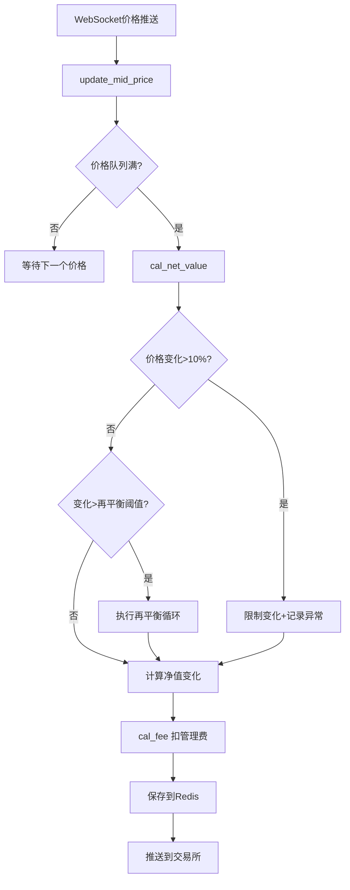
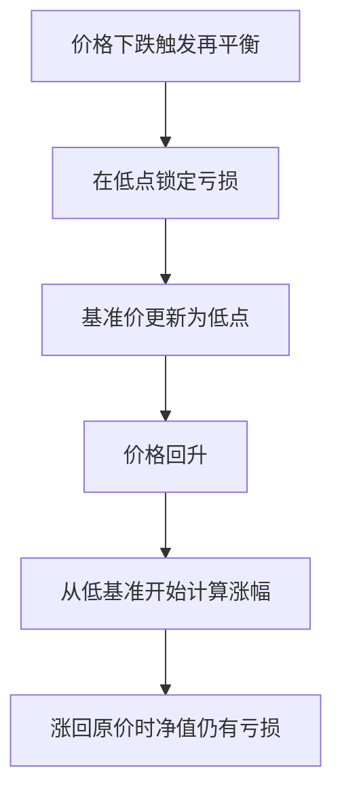
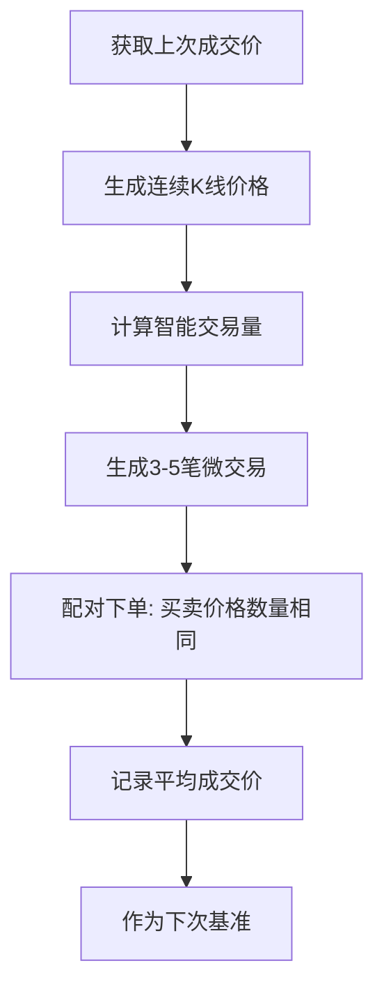

# ETF做市系统技术文档

本文档详细说明XT ETF做市系统的核心算法和机制。

## 目录

1. [净值计算系统](#1-净值计算系统)
2. [再平衡机制](#2-再平衡机制)
3. [洗盘控制器](#3-洗盘控制器)
4. [管理费计算](#4-管理费计算)

---

## 1. 净值计算系统

### 1.1 代码位置

- **核心文件**: `etf/net_value_improved.py`
- **核心类**: `ImprovedNetValue`
- **核心方法**: `cal_net_value()` (第468-544行)

### 1.2 核心公式

```
净值变化公式:
┌─────────────────────────────────────────────────────────┐
│  v = (p1 - p0) / p0        # 价格变化率                 │
│                                                         │
│  做多: net_value = net_value × (1 + lever × v)          │
│  做空: net_value = net_value × (1 - lever × v)          │
│                                                         │
│  管理费: net_value = net_value × (1 - time_gap_fee)     │
└─────────────────────────────────────────────────────────┘
```

### 1.3 变量说明

| 变量 | 含义 | 示例 |
|------|------|------|
| `p0` | 上一个价格 | 50000 |
| `p1` | 当前价格 | 51000 |
| `v` | 价格变化率 | 0.02 (2%) |
| `lever` | 杠杆倍数 | 3x / 5x |
| `time_gap_fee` | 每次更新的管理费 | 0.0003 (年化3%换算) |

### 1.4 计算示例

**3x做多，价格上涨2%:**
```
v = 0.02
新净值 = 旧净值 × (1 + 3 × 0.02) = 旧净值 × 1.06
→ 价格涨2%，净值涨6%
```

**3x做空，价格上涨2%:**
```
v = 0.02
新净值 = 旧净值 × (1 - 3 × 0.02) = 旧净值 × 0.94
→ 价格涨2%，净值跌6%
```

### 1.5 数据流图



### 1.6 保护机制

1. **价格异常保护** (`max_single_change=0.10`):
   - 单次变化>10% → 限制为10%
   - 记录异常事件到数据库

2. **重启恢复** (`_recover_net_value`):
   - 检测断线时间
   - 补偿缺失的管理费

---

## 2. 再平衡机制

### 2.1 什么是再平衡

**再平衡是杠杆ETF的核心风控机制**，当价格变化超过阈值时分段计算净值，防止极端行情下净值归零。

### 2.2 代码实现

**位置**: `etf/net_value_improved.py:520-536`

```python
# 处理再平衡
while abs(v) > self.rebalance:  # v=价格变化率, rebalance=阈值(默认5%)
    adjustment = side * self.rebalance  # 每次调整5%
    p0 = p0 * (1 + adjustment)          # 更新基准价格
    
    # 做多：价格上涨净值增加，价格下跌净值减少
    if self.long:
        net_value = net_value * (1 + self.m_lever * adjustment)
    # 做空：相反
    else:
        net_value = net_value * (1 - self.m_lever * adjustment)
    
    v = (p1 - p0) / p0  # 重新计算剩余变化
```

### 2.3 为什么需要再平衡

**无再平衡的问题：**
```
3x做多ETF，价格一次性下跌35%

净值变化 = 1 × (1 + 3 × (-0.35)) = 1 × (-0.05) = -0.05 ❌
→ 净值变成负数！ETF爆仓！
```

**有再平衡时：**
```
分成7段，每段5%处理
第1段: 1 × (1 + 3 × (-0.05)) = 0.85
第2段: 0.85 × (1 + 3 × (-0.05)) = 0.7225
...
最终: 约 0.36 ✅ 还有36%净值
```

### 2.4 再平衡在不同市场的效果

#### 2.4.1 单边上涨（做多）

**无再平衡（一次性计算）：**
```
价格: 100 → 115 (+15%)
净值: 1.0 × (1 + 3 × 15%) = 1.45
收益: +45%
```

**有再平衡（5%阈值）：**
```
第1次再平衡 (价格涨5%):
  价格: 100 → 105
  净值: 1.0 × (1 + 3 × 5%) = 1.15
  基准价重置为 105

第2次再平衡 (再涨5%):
  价格: 105 → 110.25
  净值: 1.15 × (1 + 3 × 5%) = 1.3225
  基准价重置为 110.25

第3次再平衡 (再涨5%):
  价格: 110.25 → 115.76
  净值: 1.3225 × (1 + 3 × 5%) = 1.521

最终净值: 1.521 ✅ 收益 +52.1%
```

**结论：上涨时再平衡有复利效应，收益更高！**

#### 2.4.2 震荡市场（摩擦损耗）

**场景：价格先跌10%再涨回原价**

```
无再平衡（理想情况）:
价格: 100 → 90 → 100 (回到原点)
净值: 1.0 → 0.70 → 1.0 ✅ 完美回本

有再平衡(5%阈值):
价格: 100 → 95 (触发再平衡) → 90 → 95 → 100

第1次再平衡: 净值 1.0 × (1 + 3×(-5%)) = 0.85
             基准价重置为 95
第2次再平衡: 净值 0.85 × (1 + 3×(-5%)) = 0.7225
             基准价重置为 90.25

价格回升时:
90.25 → 95: 净值 0.7225 × (1 + 3×5.26%) = 0.836
95 → 100:   净值 0.836 × (1 + 3×5.26%) = 0.968

最终净值: 0.968 ❌ 亏损3.2%！
```

**价格回到原点，但净值没回来！这就是摩擦损耗。**

### 2.5 摩擦损耗的本质



**摩擦成本 ≠ 交易手续费**，而是：
1. **锁定亏损效应** - 下跌再平衡 = 低点止损
2. **路径依赖** - 同样起终点，震荡路径净值更低
3. **波动损耗** - 震荡越多，净值磨损越大

### 2.6 做多 vs 做空 效果对比

#### 单边上涨时

| | 做多 (Long) | 做空 (Short) |
|--|------------|--------------|
| 净值方向 | 📈 上涨 | 📉 下跌 |
| 再平衡效果 | ✅ 复利加仓，收益放大 | ✅ 减仓止损，避免归零 |
| 最终结果 | 超额收益 | 减少亏损 |

#### 单边下跌时

| | 做多 (Long) | 做空 (Short) |
|--|------------|--------------|
| 净值方向 | 📉 下跌 | 📈 上涨 |
| 再平衡效果 | ✅ 减仓止损，避免归零 | ✅ 复利加仓，收益放大 |
| 最终结果 | 减少亏损 | 超额收益 |

#### 震荡市场

| | 做多 (Long) | 做空 (Short) |
|--|------------|--------------|
| 再平衡效果 | ❌ 摩擦损耗 | ❌ 摩擦损耗 |
| 最终结果 | 净值磨损 | 净值磨损 |

### 2.7 阈值设置建议

**当前配置** (`config/strategies.yaml`):
```yaml
rebalance_threshold: 0.05  # 所有策略统一5%
```

**推荐配置：**

| 杠杆 | 推荐阈值 | 理由 |
|------|----------|------|
| 3x | **5%** (0.05) | 标准值，15%价格变化才触发净值归零保护 |
| 5x | **3-4%** (0.03-0.04) | 高杠杆更敏感，需要更小阈值 |
| 2x | 7-10% (0.07-0.10) | 低杠杆风险小，可放宽 |

**阈值选择公式：**
```
安全价格变化阈值 = rebalance × (lever - 1)

示例：
- 3x杠杆, rebalance=5%: 安全变化 = 5% × 2 = 10%
- 5x杠杆, rebalance=3%: 安全变化 = 3% × 4 = 12%
```

### 2.8 总结

```
            做多 (Long)          做空 (Short)
            ──────────           ───────────
单边上涨:    ✅ 超额收益           ✅ 减少亏损
单边下跌:    ✅ 减少亏损           ✅ 超额收益
震荡行情:    ❌ 净值磨损           ❌ 净值磨损
```

**再平衡对单边行情的受益方有利，对震荡两边都不利。**

---

## 3. 洗盘控制器

### 3.1 概述

**洗盘 (Wash Trading)** 是通过自成交创建交易量和K线的机制，用于维护市场流动性。

### 3.2 代码位置

- **核心文件**: `etf/washing.py`
- **核心类**: `WashController` (第359-1428行)
- **核心方法**: `wash()` (第863-1059行)

### 3.3 工作原理

```
目的: 创建自成交的配对订单，生成交易量和K线
      ↓
方式: 同时下买单和卖单，价格数量完全相同
      ↓
效果: 制造市场活跃假象，提供流动性
```

### 3.4 工作流程



### 3.5 关键方法

| 方法 | 作用 |
|------|------|
| `generate_continuous_price()` | 生成连续K线价格（趋势+震荡） |
| `calculate_smart_volume()` | 计算智能交易量 |
| `generate_micro_trades()` | 拆分成3-5笔小单 |
| `wash()` | 执行配对下单 |

### 3.6 风险控制

```python
# 核心安全措施:
1. 黑名单检查 - 跳过被标记的交易对
2. 价格偏离限制 - 防止偏离净值±2%
3. 最小交易额 - 确保单笔 >= 5 USDT
4. 波动率限制 - 防止异常波动
```

### 3.7 配置参数

```yaml
# config/strategies.yaml 中的洗盘配置
washing_interval: 30-60      # 洗盘间隔（秒）
wash_order_delay_ms: 50      # 配对订单间隔（毫秒）
bid_ask_spread: 0.008        # 买卖价差
```

### 3.8 配对订单示例

```
价格=100, 数量=10

买单: 100 x 10  ←─┐
                   ├─ 自成交
卖单: 100 x 10  ←─┘

→ 生成成交记录，形成K线
```

---

## 4. 管理费计算

### 4.1 代码位置

**方法**: `cal_fee()` (`etf/net_value_improved.py:546-552`)

```python
def cal_fee(self, net_value: float) -> float:
    """扣除管理费"""
    net_value_after_fee = net_value * (1 - self.time_gap_fee)
    return net_value_after_fee
```

### 4.2 费率换算

```python
# 初始化时计算每次更新的费率
time_gap_fee = daily_fee / (24 * 60 * 60) * time_gap_second

# 示例：
# 年化3% → 日费约0.0082% → 每10秒约0.00000095%
```

### 4.3 计算示例

```
假设:
- daily_fee = 0.001 (日费0.1%)
- time_gap_second = 10 (每10秒更新)

time_gap_fee = 0.001 / 86400 * 10 ≈ 0.000000116

每次更新扣费:
净值 1.0 → 1.0 × (1 - 0.000000116) ≈ 0.999999884
```

---

## 附录

### A. Redis数据结构

```
netvalue_{symbol}{lever}{l/s}          # 简单净值
netvalue_{symbol}{lever}{l/s}_detail   # 详细数据（JSON）
netvalue_{symbol}{lever}{l/s}_history  # 历史记录（List，最近1000条）
```

### B. 关键配置文件

- `config/strategies.yaml` - 策略参数配置
- `etf/net_value_improved.py` - 净值计算核心
- `etf/washing.py` - 洗盘控制器

### C. 参考链接

- 项目进度报告: `docs/PROJECT_PROGRESS_REPORT.md`
- 技术债务跟踪: `docs/TECHNICAL_DEBT.md`
- 开发路线图: `docs/DEVELOPMENT_ROADMAP.md`
