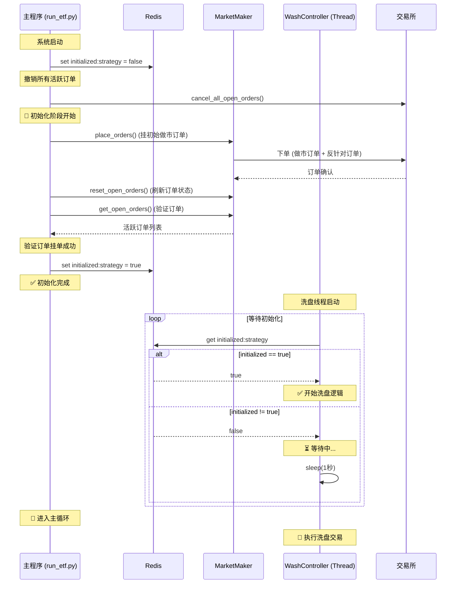
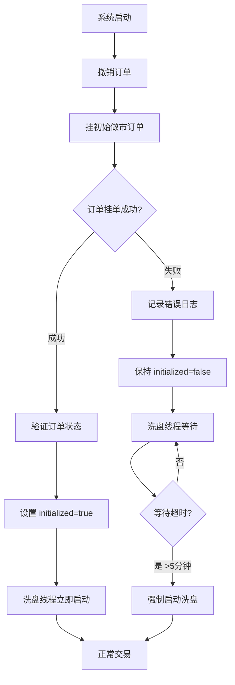

# 交易系统初始化机制

## 概述

为了避免在市场出现大幅波动（插针）时，系统在初始化不完整的情况下就开始交易，我们实现了一个明确的初始化阶段机制。这个机制确保做市订单和反针对订单都挂好之后，才启动洗盘逻辑。

## 核心设计

### 初始化阶段流程



### 关键组件

#### 1. Redis 标志位

使用 Redis 存储初始化状态，Key 格式：`initialized:{strategy_name}`

- **值**: `"true"` 或 `"false"`
- **作用**: 跨进程共享初始化状态
- **生命周期**: 系统启动时创建，退出时删除

#### 2. 初始化阶段逻辑 (run_etf.py)

```python
# 设置初始化标志为 False
r.set(f"initialized:{strategy_name}", "false")

# Step 1: 挂初始做市订单
market_maker.place_orders(config, ...)

# Step 2: 验证订单挂单状态
market_maker.order_manager.reset_open_orders(config["symbol"])
open_orders = market_maker.order_manager.get_open_orders(config["symbol"])

# Step 3: 设置初始化完成标志
r.set(f"initialized:{strategy_name}", "true")
```

#### 3. 洗盘控制器等待逻辑 (WashController.run)

```python
# 等待初始化完成
max_wait_time = 300  # 最多等待5分钟
while elapsed_time < max_wait_time:
    initialized = r.get(f"initialized:{strategy_name}")
    if initialized == "true":
        break
    time.sleep(1)
    elapsed_time += 1

# 超时保护
if elapsed_time >= max_wait_time:
    logging.warning("等待初始化超时，强制启动洗盘控制器")
```

## 时序图

### 正常启动流程

```mermaid
gantt
    title 系统初始化时序
    dateFormat  ss
    axisFormat  %S秒
    
    section 主程序
    撤销订单           :a1, 00, 10s
    挂做市订单         :a2, after a1, 5s
    验证订单状态       :a3, after a2, 2s
    设置initialized=true :milestone, a4, after a3, 1s
    进入主循环         :a5, after a4, 300s
    
    section 洗盘线程
    启动线程           :b1, 00, 3s
    等待初始化         :b2, after b1, 14s
    开始洗盘逻辑       :b3, after b2, 300s
```



### 异常场景处理



## 配置参数

### 等待参数

- **max_wait_time**: 最多等待时间（默认: 300秒 = 5分钟）
- **wait_interval**: 检查间隔（默认: 1秒）
- **log_interval**: 日志打印间隔（默认: 10秒）

### 验证参数

- **初始化验证**: 检查活跃订单数量
- **订单分类**: 区分做市订单和反针对订单
- **失败处理**: 初始化失败时保持 `initialized=false`

## 日志示例

### 成功初始化

```
======================================================================
🚀 开始初始化阶段
======================================================================
✅ 初始化标志已设置为 false (strategy=stg3l)
📝 Step 1: 挂初始做市订单...
✅ 初始做市订单已挂单
📝 Step 2: 验证订单挂单状态...
✅ 当前活跃订单数: 1002
   - 做市订单: 1000
   - 反针对订单: 2
📝 Step 3: 设置初始化完成标志...
✅ 初始化完成！洗盘逻辑现在可以启动
======================================================================
🎯 进入主循环
======================================================================
```

### 洗盘线程等待

```
======================================================================
🔒 洗盘控制器等待初始化完成 (strategy=stg3l)
======================================================================
⏳ 等待初始化完成... (0秒)
⏳ 等待初始化完成... (10秒)
✅ 初始化已完成，洗盘控制器现在启动
======================================================================
🚀 洗盘控制器正式启动
======================================================================
```

### 初始化失败

```
======================================================================
🚀 开始初始化阶段
======================================================================
✅ 初始化标志已设置为 false (strategy=stg3l)
📝 Step 1: 挂初始做市订单...
❌ 初始化阶段失败: [错误详情]
继续运行主循环，但洗盘逻辑将等待初始化完成
======================================================================
```

## 监控指标

### Redis 监控

```bash
# 查看当前初始化状态
redis-cli get "initialized:stg3l"

# 查看所有策略的初始化状态
redis-cli keys "initialized:*"

# 手动设置初始化状态（调试用）
redis-cli set "initialized:stg3l" "true"
```

### 系统状态检查

```python
import redis

r = redis.StrictRedis(host="localhost", port=6379, db=0, decode_responses=True)

# 检查初始化状态
strategy_name = "stg3l"
initialized = r.get(f"initialized:{strategy_name}")
print(f"策略 {strategy_name} 初始化状态: {initialized}")
```

## 故障排查

### 问题1: 洗盘线程一直等待

**症状**: 洗盘线程日志显示持续等待初始化

**排查步骤**:
1. 检查 Redis 连接: `redis-cli ping`
2. 检查初始化标志: `redis-cli get "initialized:stg3l"`
3. 查看主程序日志，确认初始化阶段是否执行
4. 检查订单挂单是否成功

**解决方案**:
- 如果 Redis 不可用，重启 Redis 服务
- 如果初始化失败，检查交易所 API 连接
- 如果订单挂单失败，检查资金和配置

### 问题2: 初始化超时

**症状**: 洗盘线程显示 "等待初始化超时"

**原因分析**:
- 订单挂单失败
- 网络延迟导致订单确认慢
- Exchange API 响应缓慢

**解决方案**:
- 增加 `max_wait_time` 参数
- 检查网络连接和 API 限流
- 优化订单挂单逻辑

### 问题3: 系统退出后标志未清理

**症状**: 重启系统时直接使用旧的初始化标志

**影响**: 可能导致跳过初始化阶段

**解决方案**:
```bash
# 手动清理所有初始化标志
redis-cli keys "initialized:*" | xargs redis-cli del
```

## 性能影响

### 启动时间

- **额外延迟**: 约 5-17 秒（取决于订单数量）
  - 挂订单: 5秒
  - 验证订单: 2秒
  - Redis 操作: <1秒
  - 洗盘线程等待: 10-15秒（包含随机延迟）

### 资源开销

- **Redis 内存**: 每个策略约 50 字节
- **CPU 开销**: 可忽略（仅轮询检查）
- **网络开销**: 增加 1 次 REST API 调用（验证订单）

## 最佳实践

1. **监控初始化状态**: 定期检查 Redis 中的初始化标志
2. **日志审查**: 关注初始化阶段的日志，确保成功完成
3. **超时配置**: 根据网络环境调整 `max_wait_time`
4. **异常告警**: 对初始化失败和超时设置告警
5. **手动干预**: 准备手动设置初始化标志的脚本

## 未来改进

1. **健康检查接口**: 提供 HTTP 接口查询初始化状态
2. **自动重试**: 初始化失败后自动重试机制
3. **更细粒度控制**: 支持单独控制做市和反针对订单的初始化
4. **分布式锁**: 使用 Redis 分布式锁避免重复初始化
5. **Metrics 集成**: 将初始化时间和成功率导出到 Prometheus

## 总结

这个初始化机制通过以下方式提高了系统的稳定性和可靠性：

1. ✅ **明确的初始化阶段**: 确保订单挂好后再开始交易
2. ✅ **跨进程同步**: 使用 Redis 共享初始化状态
3. ✅ **超时保护**: 避免无限等待导致系统卡死
4. ✅ **详细日志**: 便于监控和故障排查
5. ✅ **清理机制**: 系统退出时自动清理标志

通过这个机制，系统在面对市场大幅波动时能够更加稳定地启动和运行。
