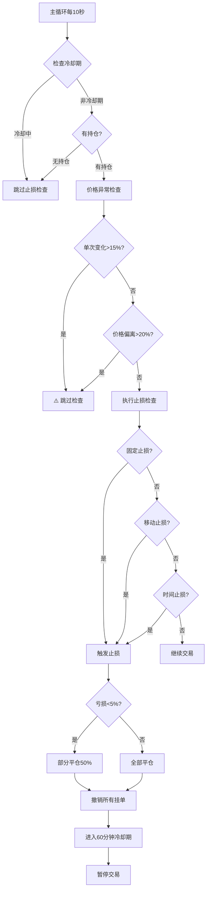

# 止损机制详解

## 📊 概述

止损系统是 ETF 交易系统的核心风控组件，通过**三重保护机制**防止过度亏损，并配合**价格异常检测**避免虚假触发。

## 🎯 三种止损类型

### 1️⃣ 固定止损 (Fixed Stop Loss)

**原理**: 当亏损超过固定阈值时触发

**计算公式**:
```python
# 做多
盈亏率 = (当前价 - 入场价) / 入场价

# 做空
盈亏率 = (入场价 - 当前价) / 入场价

触发条件: 盈亏率 <= fixed_threshold
```

**配置示例**:
```yaml
# ton3s (3x做空)
fixed_threshold: -0.02  # 亏损2%触发
```

**触发场景**:
```
入场价: 1.0682
当前价: 1.0896  # 做空亏损
盈亏率 = (1.0682 - 1.0896) / 1.0682 = -2.00%
结果: ✅ 触发固定止损
```

---

### 2️⃣ 移动止损 (Trailing Stop Loss)

**原理**: 跟踪最优价位，从最优点回撤一定比例时触发

#### 做多场景
```python
最高价: 持仓期间出现的最高价格
回撤率 = (最高价 - 当前价) / 最高价

触发条件: 回撤率 >= trailing_stop
```

**示例**:
```
入场价: 50,000
最高价: 52,000 (盈利4%)
当前价: 51,480 (回撤1%)
trailing_stop: 0.01 (1%)

回撤率 = (52,000 - 51,480) / 52,000 = 1.00%
结果: ✅ 触发移动止损，锁定3%利润
```

#### 做空场景 (ton3s案例)
```python
最低价: 持仓期间出现的最低价格
反弹率 = (当前价 - 最低价) / 最低价

触发条件: 反弹率 >= trailing_stop
```

**示例**:
```
入场价: 1.0682
最低价: 1.0543 (盈利1.30%)  ← 做空最优点
当前价: 1.0650 (反弹1.01%)
trailing_stop: 0.01 (1%)

反弹率 = (1.0650 - 1.0543) / 1.0543 = 1.01%
结果: ✅ 触发移动止损
实际盈利: (1.0682 - 1.0650) / 1.0682 = 0.30%
```

**关键点**:
- ✅ **保护浮盈**: 价格到达有利位置后，止损线跟随移动
- ✅ **锁定利润**: 即使最终回撤，也能锁定部分利润
- ⚠️ **敏感度**: 做空的 trailing_stop = 1%，意味着从最低点反弹 1% 就触发

---

### 3️⃣ 时间止损 (Time-Based Stop Loss)

**原理**: 持仓时间过长且处于亏损状态时触发

**触发条件**:
```python
持仓时间 > time_stop_hours AND 盈亏率 < 0
```

**配置示例**:
```yaml
# ton3s (3x做空，风险高)
time_stop: 24  # 24小时

# stg5s (5x做空，风险更高)
time_stop: 8   # 8小时
```

**触发场景**:
```
入场时间: 2025-11-22 10:00
当前时间: 2025-11-23 11:00 (25小时后)
当前盈亏: -0.5%

结果: ✅ 触发时间止损（持仓超过24小时且亏损）
```

---

## 🛡️ 价格异常保护机制

为了防止**数据错误**或**市场极端波动**导致的虚假触发，系统内置**三重价格检查**：

### 保护1️⃣: 单次变化保护 (15%)

```python
price_change_rate = abs(当前价 - 入场价) / 入场价

if price_change_rate > 0.15:  # 超过15%
    ⚠️ 跳过本次止损检查
```

**场景**: 防止数据异常
```
入场价: 1.0682
异常价格: 1.2500  # 突然跳价+17%
系统判断: 价格异常，跳过止损检查 ✅
```

### 保护2️⃣: 价格偏离保护 (20%)

**做多**:
```python
price_deviation = abs(最高价 - 当前价) / 最高价

if price_deviation > 0.20:  # 偏离超过20%
    ⚠️ 跳过本次止损检查
```

**做空**:
```python
price_deviation = abs(当前价 - 最低价) / 最低价

if price_deviation > 0.20:  # 偏离超过20%
    ⚠️ 跳过本次止损检查
```

**场景**: 防止最高/最低价记录错误
```
最低价: 1.0543 (可能是错误数据)
当前价: 1.3000  # 偏离23%
系统判断: 偏离过大，跳过止损检查 ✅
```

### 保护3️⃣: 价格比例保护 (10倍)

```python
price_ratio = max(入场价, 当前价) / min(入场价, 当前价)

if price_ratio > 10.0:  # 超过10倍
    返回 0.0 盈亏率，避免触发止损
```

**场景**: 防止极端异常
```
入场价: 1.0682
异常价格: 15.0000  # 14倍异常
系统判断: 价格异常，返回0盈亏率 ✅
```

---

## ⚙️ 止损执行流程



---

## 📋 配置参数对照表

| 策略 | 杠杆 | 方向 | 固定止损 | 移动止损 | 时间止损 | 冷却期 |
|------|------|------|----------|----------|----------|--------|
| **ton3l** | 3x | 做多 | -2% | 1% | 24h | 60min |
| **ton3s** | 3x | 做空 | -2% | 1% | 24h | 60min |
| **stg3l** | 3x | 做多 | -2% | 1% | 24h | 60min |
| **stg3s** | 3x | 做空 | -2% | 1% | 24h | 60min |
| **stg5l** | 5x | 做多 | -1.5% | 0.8% | 12h | 60min |
| **stg5s** | 5x | 做空 | -1% | 0.5% | 8h | 60min |

### 参数设计原则

1. **杠杆越高 → 止损越严格**
   - 3x: -2% 固定止损
   - 5x long: -1.5%
   - 5x short: -1%

2. **做空风险 > 做多 → 参数更保守**
   - stg5l (5x long): trailing_stop = 0.8%
   - stg5s (5x short): trailing_stop = 0.5%

3. **高杠杆 → 更短持仓时间**
   - 3x: 24小时
   - 5x long: 12小时
   - 5x short: 8小时

---

## 🔄 止损动作

### 部分平仓 (50%)

**触发条件**: 亏损 < 5% 且启用 `enable_partial_close`

```yaml
enable_partial_close: true
```

**示例**:
```
持仓量: 100
亏损率: -1.5%
动作: 平仓 50 (保留 50)
```

**目的**:
- ✅ 降低风险敞口
- ✅ 保留部分仓位，避免错过反弹

### 全部平仓

**触发条件**: 亏损 >= 5%

```
持仓量: 100
亏损率: -6%
动作: 平仓 100 (全部)
```

### 冷却期机制

**执行步骤**:
1. 撤销所有挂单
2. 记录止损时间
3. 进入 60 分钟冷却期
4. 冷却期内暂停做市（只保留洗盘交易）

**目的**:
- ✅ 避免频繁止损
- ✅ 给市场时间恢复
- ✅ 防止连续亏损

---

## 📊 实际案例分析

### 案例1: ton3s 移动止损触发 (2025-11-22 12:22)

```
持仓信息:
  入场价: 1.0682
  持仓量: 18.93
  方向: 做空 (short)

价格走势:
  最低价: 1.0543 (盈利1.30%)  ← 最优点
  当前价: 1.0821 (反弹2.63%)

止损检查:
  反弹率 = (1.0821 - 1.0543) / 1.0543 = 2.63%
  阈值: 1%
  结果: ✅ 触发移动止损

实际盈亏:
  盈亏率 = (1.0682 - 1.0821) / 1.0682 = -1.30%

止损动作:
  持仓: 18.93
  平仓: 9.47 (50%)
  原因: 亏损 -1.30% < 5%，部分平仓

后续:
  撤销所有挂单
  进入 60 分钟冷却期
  冷却结束后恢复交易
```

### 案例分析

**为什么触发?**
- ✅ 价格从最低点 1.0543 反弹到 1.0821
- ✅ 反弹幅度 2.63% > 阈值 1%
- ✅ 移动止损成功保护浮盈

**是否合理?**
- ✅ **合理**: 做空在最低点 1.0543 时盈利 1.30%
- ✅ **合理**: 反弹超过 1% 后及时止损，避免更大亏损
- ✅ **结果**: 最终亏损 -1.30%，但避免了继续上涨的风险

**是否为虚假触发?**
- ❌ **不是**: 价格变化在合理范围内（未超过15%保护阈值）
- ❌ **不是**: 价格偏离最低价在20%以内
- ✅ **结论**: 正常的风险保护机制触发

---

## 🔧 参数调优建议

### 如果止损过于频繁

**问题**: 移动止损太敏感，频繁触发

**解决方案1**: 放宽移动止损阈值
```yaml
# 从 1% 提高到 1.5%
trailing_stop: 0.015
```

**解决方案2**: 调整价格更新频率
```yaml
# 降低主循环频率
sleep_interval: 15  # 从 10秒 改为 15秒
```

### 如果担心风险

**问题**: 止损不够及时，亏损较大

**解决方案1**: 收紧移动止损
```yaml
# 从 1% 降低到 0.8%
trailing_stop: 0.008
```

**解决方案2**: 更严格的固定止损
```yaml
# 从 -2% 提高到 -1.5%
fixed_threshold: -0.015
```

### 如果出现虚假触发

**问题**: 价格数据异常导致误触发

**当前保护**:
- ✅ 已实现 15% 单次变化保护
- ✅ 已实现 20% 价格偏离保护
- ✅ 已实现 10倍 价格比例保护

**增强方案**: 可考虑调整保护阈值
```python
# 在 stop_loss.py 中调整
price_change_rate > 0.20  # 从15%提高到20%
price_deviation > 0.30    # 从20%提高到30%
```

---

## 📈 监控和调试

### 查看止损历史

```bash
# 查看所有止损触发记录
grep "止损触发" logs/ton3s/ton3s.log

# 查看最近10次止损
grep "止损触发" logs/ton3s/ton3s.log | tail -10

# 统计止损触发次数
grep "止损触发" logs/ton3s/ton3s.log | wc -l
```

### 实时监控

```bash
# 实时监控止损触发
tail -f logs/ton3s/ton3s.log | grep --line-buffered "止损触发"

# 监控所有风险事件
tail -f logs/ton3s/ton3s.log | grep -E "(止损|冷却|风险)"
```

### 检查当前状态

```python
# 使用 Redis 检查冷却期
import redis
from datetime import datetime

r = redis.Redis(host='localhost', port=6379, db=0)
cooldown_until = r.get("stop_loss_cooldown:ton3s")

if cooldown_until:
    cooldown_time = datetime.fromisoformat(cooldown_until.decode())
    now = datetime.now()
    if now < cooldown_time:
        remaining = (cooldown_time - now).total_seconds() / 60
        print(f"冷却期剩余: {remaining:.1f} 分钟")
    else:
        print("冷却期已结束")
else:
    print("无冷却期限制")
```

---

## 💡 最佳实践

### 1. 定期检查止损历史

```bash
# 每周检查止损触发次数和原因
grep "止损触发" logs/*/$(date +%Y-%m-%d)*.log | wc -l
```

### 2. 根据市场调整参数

**波动大市场**: 放宽移动止损（避免频繁触发）
```yaml
trailing_stop: 0.015  # 1.5%
```

**波动小市场**: 收紧移动止损（更好保护）
```yaml
trailing_stop: 0.008  # 0.8%
```

### 3. 关注冷却期影响

```bash
# 统计冷却期导致的暂停时间
grep "进入冷却期" logs/ton3s/ton3s.log
```

**如果冷却期过于频繁**:
- 考虑延长冷却时间（从60min到90min）
- 或者放宽止损参数

### 4. 生产环境建议

**保守策略** (推荐):
```yaml
fixed_threshold: -0.015    # -1.5%
trailing_stop: 0.012       # 1.2%
time_stop: 18              # 18小时
```

**激进策略**:
```yaml
fixed_threshold: -0.025    # -2.5%
trailing_stop: 0.008       # 0.8%
time_stop: 12              # 12小时
```

---

## ❓ 常见问题

### Q1: 为什么移动止损有时候亏损还触发？

**A**: 移动止损保护的是**浮盈**，不是**总盈亏**。

示例:
```
入场价: 100
最低价: 95 (盈利5%)  ← 做空最优点
当前价: 96.05 (反弹1.05%)

触发原因: 从最低点反弹 > 1%
总盈亏: +3.95% (仍然盈利)
```

### Q2: 价格异常保护会不会导致真实风险无法止损？

**A**: 不会。保护阈值设计合理:
- 15% 单次变化：正常市场不会出现
- 20% 价格偏离：只过滤极端异常
- 下一个检查周期（10秒后）会重新检查

### Q3: 如何暂时禁用止损？

**A**: 修改配置文件:
```yaml
stop_loss:
  enabled: false  # 禁用止损
```

**警告**: ⚠️ 仅在测试环境使用，生产环境不推荐！

### Q4: 冷却期可以手动重置吗？

**A**: 可以通过 Redis 手动清除:
```bash
redis-cli DEL stop_loss_cooldown:ton3s
```

**或者**重启策略（会自动清除冷却期）

---

## 🚀 总结

止损系统是 **三重保护 + 三重检查** 的完整风控体系：

**三重保护**:
1. ✅ 固定止损 - 防止超过预设亏损
2. ✅ 移动止损 - 保护浮盈，锁定利润
3. ✅ 时间止损 - 避免长期亏损持仓

**三重检查**:
1. ✅ 15% 单次变化保护 - 防止数据异常
2. ✅ 20% 价格偏离保护 - 防止记录错误
3. ✅ 10倍 价格比例保护 - 防止极端异常

**智能执行**:
- 部分平仓 (亏损 < 5%)
- 全部平仓 (亏损 >= 5%)
- 60分钟冷却期

**监控建议**:
- 定期检查止损历史
- 根据市场调整参数
- 关注虚假触发情况

---

## 📚 相关文档

- [风险控制系统实施文档](RISK_CONTROL_IMPLEMENTATION.md)
- [配置文件说明](../config/strategies.yaml)
- [代码实现](../etf/risk/stop_loss.py)

---

**最后更新**: 2025-11-22
**版本**: 1.0
**作者**: ETF Trading System Team
