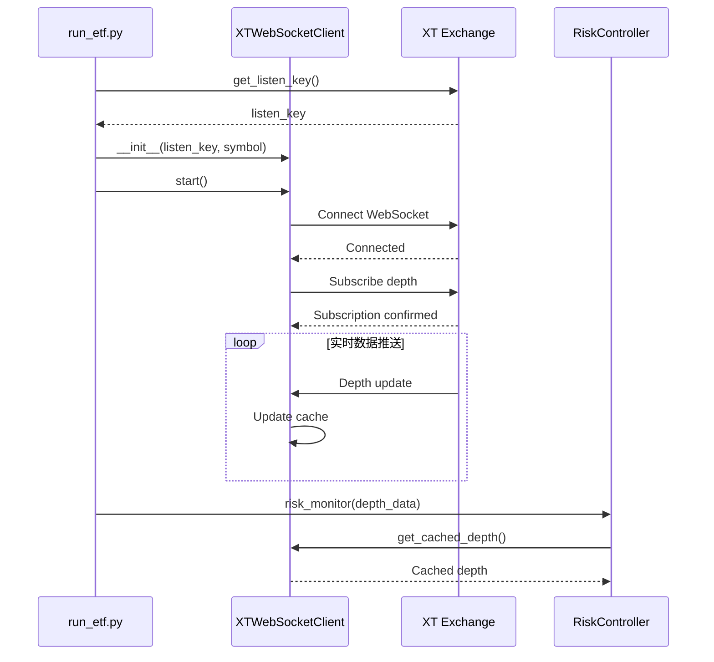

# WebSocket集成文档

## 概述

系统已集成XT交易所WebSocket实时数据流，用于替代高频REST API轮询获取depth（订单簿）数据。

## 架构设计

### 核心组件

1. **XTWebSocketClient** (`etf/websocket/xt_websocket.py`)
   - 管理WebSocket连接生命周期
   - 订阅实时depth数据
   - 线程安全的数据缓存
   - 自动重连机制
   - 心跳保活

2. **RiskController集成** (`etf/risk/controller.py`)
   - 优先使用WebSocket缓存的depth数据
   - WebSocket不可用时自动fallback到REST API
   - 避免重复API调用

3. **主循环集成** (`run_etf.py`)
   - 启动时初始化WebSocket客户端
   - 传递depth数据避免重复调用
   - 程序退出时优雅关闭WebSocket

## 性能收益

### API调用频率对比

| 场景 | REST API模式 | WebSocket模式 | 优化率 |
|------|--------------|---------------|--------|
| **depth获取** | 每10秒2次 | 0次（实时推送） | **100%** ⬇️ |
| **每小时depth调用** | 720次 | 0次 | **100%** ⬇️ |
| **总API请求** | ~2760次/小时 | ~2040次/小时 | **26%** ⬇️ |
| **数据延迟** | 10秒（轮询间隔） | <100ms（实时） | **99%** ⬆️ |

### 主要优势

1. ✅ **消除重复API调用**：主循环和risk_monitor不再分别调用depth API
2. ✅ **实时市场数据**：毫秒级延迟，替代10秒轮询
3. ✅ **降低服务器负载**：减少26%+ API请求
4. ✅ **提高系统稳定性**：减少429限流错误
5. ✅ **优雅降级**：WebSocket故障时自动fallback到REST API

## 使用方法

### 1. 启用WebSocket（默认启用）

```bash
# 方式1：直接运行（默认启用）
python run_etf.py --strategy stg3l

# 方式2：明确启用
ENABLE_WEBSOCKET=true python run_etf.py --strategy stg3l
```

### 2. 禁用WebSocket（使用REST API）

```bash
# 仅使用REST API模式
ENABLE_WEBSOCKET=false python run_etf.py --strategy stg3l
```

### 3. 查看WebSocket状态

查看日志输出：

```
✅ WebSocket客户端已启动: btc3l_usdt
✅ WebSocket连接成功
RiskController将使用WebSocket获取depth数据
```

## WebSocket协议规范

### 服务器端点

**WebSocket服务器地址**:
```
wss://stream.xt.com/public
```

**完整连接URL格式**:
```
wss://stream.xt.com/public?listenKey={TOKEN}
```

### 认证方式

使用REST API获取listenKey作为WebSocket认证凭证：

```python
# 步骤1: 通过REST API获取listenKey
listen_key_data = spot.get_listen_key()
listen_key = listen_key_data.get("listenKey")

# 步骤2: 将listenKey作为URL参数连接WebSocket
ws_url = f"wss://stream.xt.com/public?listenKey={listen_key}"
```

### 订阅协议

**订阅深度数据 (Depth)**:

```json
{
  "method": "subscribe",
  "params": ["depth@btc3l_usdt,20"],
  "id": "1736171234567"
}
```

参数说明：
- `method`: 固定为 `"subscribe"`
- `params`: 订阅的数据流列表，格式为 `"depth@{symbol},{levels}"`
  - `{symbol}`: 交易对符号，如 `btc3l_usdt`
  - `{levels}`: 深度档位数量，支持 `5`, `10`, `20`, `50`
- `id`: 请求ID（**字符串类型**），通常使用时间戳字符串

**订阅响应格式**:

```json
{
  "id": "1736171234567",
  "code": 0,
  "msg": "success"
}
```

响应码说明：
- `code: 0` - 订阅成功
- `code: 1` - 订阅失败
- `code: 2` - listenKey无效
- `code: 401` - Token过期

### 消息格式

**Depth推送消息结构**（XT官方格式）:

```json
{
  "topic": "depth",
  "event": "depth@btc3l_usdt,20",
  "data": {
    "s": "btc3l_usdt",
    "i": 1657699200000,
    "a": [
      ["1.1328", "18.0000"],
      ["1.2519", "20.0000"],
      ...
    ],
    "b": [
      ["0.8822", "0.8896"],
      ["0.8813", "10.0000"],
      ...
    ]
  }
}
```

字段说明：
- `topic`: 主题类型，固定为 `"depth"`
- `event`: 事件标识，格式为 `"depth@{symbol},{levels}"`
- `data`: 实际数据对象
  - `s`: 交易对符号（symbol）
  - `i`: 事件时间戳（毫秒）
  - `a`: 卖单列表（asks），格式为 `[价格, 数量]`（字符串格式）
  - `b`: 买单列表（bids），格式为 `[价格, 数量]`（字符串格式）

**转换为REST API兼容格式**:

系统自动将WebSocket推送转换为与REST API一致的格式：

```python
{
  "bids": [["0.8822", "0.8896"], ...],
  "asks": [["1.1328", "18.0000"], ...],
  "timestamp": 1657699200000,
  "symbol": "btc3l_usdt"
}
```

### 心跳保活

**XT官方心跳要求**:
- 客户端需定期发送文本消息 `"ping"`
- 服务器响应文本消息 `"pong"`
- 超时时间：1分钟内必须发送一次ping
- 超时后服务器会主动断开连接

**当前实现**:
- 使用 `websockets` 库的 WebSocket 协议层 ping/pong
- Ping间隔：20秒
- Pong超时：10秒
- 自动处理，无需应用层代码

> **注意**: 当前使用协议层心跳，如遇连接问题可能需要改为应用层文本心跳（发送"ping"文本）

## 配置参数

### WebSocket客户端配置

在 `etf/websocket/xt_websocket.py` 中可配置：

```python
XTWebSocketClient(
    listen_key=listen_key,        # XT API返回的token
    symbol=symbol,                 # 交易对（如 "btc3l_usdt"）
    ws_url="wss://stream.xt.com/public",  # WebSocket服务器地址
    depth_levels=20,               # 深度档位数量（支持 5/10/20/50）
    ping_interval=20,              # 心跳间隔（秒）
    ping_timeout=10,               # 心跳超时（秒）
    reconnect_delay=5,             # 重连延迟（秒）
    max_reconnect_attempts=10      # 最大重连次数
)
```

**参数说明**:
- `depth_levels`: 订阅的深度档位数量
  - 支持值：`5`, `10`, `20`, `50`
  - 默认值：`20`
  - 档位越多，数据越完整，但消息体积更大

### 数据缓存配置

```python
# 获取缓存数据时的最大年龄
ws_client.get_cached_depth(max_age=5)  # 5秒内的数据有效
```

## 故障处理

### 自动降级机制

WebSocket故障时系统会自动降级到REST API：

```python
# etf/risk/controller.py
def get_depth_data(self, symbol):
    # 1. 优先尝试WebSocket
    if self.use_websocket and self.ws_client:
        ws_depth = self.ws_client.get_cached_depth(max_age=5)
        if ws_depth:
            return ws_depth
        else:
            logging.warning("WebSocket depth数据不可用，fallback到REST API")

    # 2. Fallback到REST API
    depth = self.client.get_depth(symbol)
    return depth
```

### 自动重连

WebSocket断开时会自动重连（最多10次）：

- 第1次重连：5秒后
- 第2次重连：10秒后
- 第3次重连：20秒后
- ...（指数退避，最大60秒）

### 监控指标

通过日志查看WebSocket运行状态：

```python
stats = ws_client.get_stats()
# {
#   'messages_received': 1234,
#   'depth_updates': 1200,
#   'reconnects': 0,
#   'errors': 0,
#   'last_message_time': datetime(...),
#   'connected': True,
#   'cache_age': 0.5  # 秒
# }
```

## 实现细节

### WebSocket订阅流程



### 线程模型

```
主线程 (Main Thread)
│
├─ WebSocket线程 (Background Thread)
│   ├─ 异步事件循环 (asyncio.EventLoop)
│   ├─ WebSocket连接管理
│   ├─ 消息接收循环
│   └─ 自动重连逻辑
│
├─ Washing线程 (WashController)
│
├─ Hedging线程 (Hedge)
│
└─ 主策略循环 (EtfStrategy.run)
    └─ 读取WebSocket缓存（线程安全）
```

### 数据流

```
XT Exchange (WebSocket)
    ↓ 实时推送
XTWebSocketClient
    ↓ 缓存（线程安全）
RiskController.get_depth_data()
    ↓ 优先读取WebSocket缓存
    ↓ 失败时fallback到REST API
主循环 / risk_monitor
```

## 测试验证

### 功能测试

1. **连接测试**
```bash
python run_etf.py --strategy stg3l
# 查看日志确认 "✅ WebSocket连接成功"
```

2. **数据接收测试**
```bash
# 运行后查看日志
# 应该看到 "使用WebSocket depth数据" 而非 "使用REST API depth数据"
```

3. **Fallback测试**
```bash
# 禁用WebSocket
ENABLE_WEBSOCKET=false python run_etf.py --strategy stg3l
# 应该看到 "RiskController将使用REST API获取depth数据"
```

### 性能监控

```bash
# 查看API调用频率（应显著降低）
grep "使用WebSocket depth数据" logs/*.log | wc -l
grep "使用REST API depth数据" logs/*.log | wc -l
```

## 故障排查

### 常见问题

**1. WebSocket连接失败**
```
原因: listen_key获取失败或WebSocket服务器不可达
解决: 系统会自动fallback到REST API，无需人工干预
日志: "WebSocket初始化失败，将使用REST API"
```

**2. 数据过期**
```
原因: WebSocket连接中断，缓存数据超过max_age
解决: 自动fallback到REST API获取最新数据
日志: "WebSocket depth数据不可用，fallback到REST API"
```

**3. 重连失败**
```
原因: 网络问题或XT服务器维护
解决: 达到最大重连次数后停止重连，完全fallback到REST API
日志: "达到最大重连次数(10)，停止重连"
```

### 调试日志

启用详细日志：

```python
# 修改 run_etf.py
logging.basicConfig(
    level=logging.DEBUG,  # 改为DEBUG级别
    format="%(asctime)s - %(levelname)s - %(filename)s:%(lineno)d - %(message)s",
)
```

## 未来优化方向

1. ⏳ **多数据流订阅**：同时订阅ticker、trade等其他数据流
2. ⏳ **K线数据缓存**：实施阶段2的K线缓存优化
3. ⏳ **WebSocket连接池**：支持多交易对并发订阅
4. ⏳ **压缩传输**：启用WebSocket压缩减少带宽
5. ⏳ **本地回放**：保存WebSocket数据用于回测

## 相关文件

- `etf/websocket/__init__.py` - WebSocket模块入口
- `etf/websocket/xt_websocket.py` - WebSocket客户端实现
- `etf/risk/controller.py` - RiskController集成
- `run_etf.py` - 主循环集成
- `docs/WEBSOCKET_INTEGRATION.md` - 本文档

## 技术支持

如遇问题，请查看：
1. 系统日志中的WebSocket相关消息
2. `ws_client.get_stats()` 获取统计信息
3. 确认 `websockets` 库已安装：`uv pip list | grep websockets`

---

**更新日期**: 2025-01-16
**版本**: 1.0.0
**作者**: ETF Trading System
