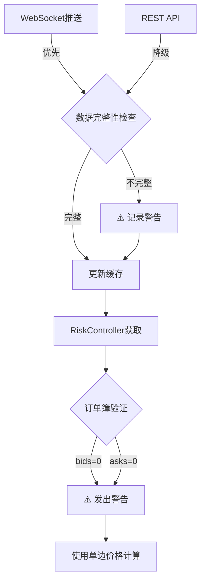

# 订单簿不完整问题分析

## 问题现象

```
WARNING | controller.py:326 | ⚠️  订单簿不完整: ton3s_usdt, bids=0, asks=100
WARNING | controller.py:327 | ⚠️  使用不完整数据计算风险等级，结果可能不准确
WARNING | common.py:44 | ⚠️  订单簿只有卖单，使用最佳卖价作为中间价: 0.562816
```

**症状**: 订单簿中只有卖单（asks=100），完全没有买单（bids=0）

## 根因分析

### 1. 数据流分析



### 2. 三层防护机制

**当前实现** (`etf/risk/controller.py:115-175`):

```python
Layer 1: WebSocket实时数据 (max_age=5s)
    ↓ 失败
Layer 2: REST API查询
    ↓ 失败
Layer 3: 缓存数据 (max_age=30s)
```

**问题**:
- 如果WebSocket推送的数据本身就不完整（bids=0）
- REST API返回的也是不完整数据
- 那么三层防护都会得到相同的不完整数据

### 3. 可能原因

#### 3.1 QA2环境数据问题
- **QA2测试环境**: `wss://stream.xt-qa2.com/public`
- **可能性**: 测试环境的模拟数据生成器有缺陷
- **证据**: 日志显示 `https://sapi.xt-qa2.com/v4/public/ticker/price`

#### 3.2 交易对流动性不足
- **ton3s_usdt**: TON 3x Short 产品
- **可能性**: 该交易对在测试环境没有足够的做市商
- **影响**: 只有单边订单（只有卖单，没有买单）

#### 3.3 WebSocket数据格式问题
**期望格式** (`xt_websocket.py:224-245`):
```json
{
  "s": "ton3s_usdt",
  "i": 1657699200000,
  "a": [["0.562816", "100.0"]],  // asks
  "b": []                         // bids - 空数组！
}
```

**问题**: 
- ✅ `a` 字段有数据
- ❌ `b` 字段为空数组 `[]`

## 代码改进

### 改进1: 增强WebSocket数据验证 ✅

**位置**: `etf/websocket/xt_websocket.py:224`

**改进内容**:
```python
def _update_depth_cache(self, depth_data: Dict[str, Any]):
    bids = depth_data.get('b', [])
    asks = depth_data.get('a', [])
    
    # ⚠️ 数据完整性检查和警告
    if not bids or not asks:
        logger.warning(
            f"⚠️ WebSocket推送的订单簿不完整: "
            f"symbol={depth_data.get('s', self.symbol)}, "
            f"bids={len(bids)}, asks={len(asks)}"
        )
        
        # 详细记录原始数据用于调试
        if not bids:
            logger.warning(f"⚠️ 买单缺失，原始数据 'b' 字段: {depth_data.get('b', 'MISSING')}")
        if not asks:
            logger.warning(f"⚠️ 卖单缺失，原始数据 'a' 字段: {depth_data.get('a', 'MISSING')}")
    
    # ✅ 即使不完整也更新缓存
    # 下游会有处理逻辑（common.py:get_mid_price_from_depth）
```

**优势**:
- 早期发现问题（在WebSocket层）
- 详细的调试信息
- 不阻断流程（允许单边订单簿）

### 改进2: 调试工具 ✅

**位置**: `scripts/debug_orderbook.py`

**功能**:
1. 测试REST API深度查询
2. 测试WebSocket实时推送
3. 对比两种数据源
4. 检测数据完整性

**使用方法**:
```bash
# QA2环境调试
python scripts/debug_orderbook.py --symbol ton3s_usdt --env qa

# 生产环境调试
python scripts/debug_orderbook.py --symbol btc_usdt --env prod

# 只测试REST API
python scripts/debug_orderbook.py --symbol ton3s_usdt --env qa --mode rest

# 只测试WebSocket（监听30秒）
python scripts/debug_orderbook.py --symbol ton3s_usdt --env qa --mode ws --duration 30
```

## 当前防护措施

### 1. 风险控制层 (`etf/risk/controller.py:320-340`)

```python
# ✅ 如果只有一边有数据，发出警告但继续计算
if not depth_data.get("bids") or not depth_data.get("asks"):
    logging.warning(f"⚠️ 订单簿不完整: {symbol}, bids={len(bids)}, asks={len(asks)}")
    logging.warning(f"⚠️ 使用不完整数据计算风险等级，结果可能不准确")
```

### 2. 价格计算层 (`etf/utils/common.py:35-55`)

```python
# ✅ 如果只有asks（买单为空），使用最佳卖价
if not bids and asks:
    best_ask = float(asks[0][0])
    logging.warning(f"⚠️ 订单簿只有卖单，使用最佳卖价作为中间价: {best_ask}")
    return best_ask

# ✅ 如果只有bids（卖单为空），使用最佳买价
if bids and not asks:
    best_bid = float(bids[0][0])
    logging.warning(f"⚠️ 订单簿只有买单，使用最佳买价作为中间价: {best_bid}")
    return best_bid
```

**优势**: 系统不会因为单边订单簿而崩溃

**劣势**: 风险计算可能不准确

## 建议解决方案

### 短期方案（已实施）

1. ✅ **增强日志**: 详细记录不完整数据的来源
2. ✅ **调试工具**: 提供专用工具诊断问题
3. ✅ **允许降级**: 使用单边价格继续运行

### 中期方案（待实施）

1. **数据源多样化**
   ```python
   # 添加第三方价格源作为备份
   Layer 1: WebSocket (XT官方)
   Layer 2: REST API (XT官方)
   Layer 3: Binance价格 (参考)
   Layer 4: 缓存数据
   ```

2. **智能降级策略**
   ```python
   if bids_count < 10 or asks_count < 10:
       # 订单簿深度不足，提高风险等级
       self.risk_level = min(self.risk_level + 1, 3)
       logger.warning(f"⚠️ 订单簿深度不足，风险等级提升至 {self.risk_level}")
   ```

3. **环境检测**
   ```python
   if self.env == "qa" and incomplete_orderbook:
       # QA环境允许不完整数据
       logger.info("QA环境：允许使用不完整订单簿")
   else:
       # 生产环境更严格
       raise InsufficientDataError("生产环境订单簿数据不完整")
   ```

### 长期方案

1. **与XT技术支持沟通**
   - 报告QA2环境的数据问题
   - 请求改进测试数据质量
   - 获取WebSocket协议更新

2. **自建订单簿管理**
   ```python
   class OrderbookManager:
       """自建订单簿管理，支持增量更新"""
       
       def __init__(self):
           self.local_orderbook = {}
       
       def apply_snapshot(self, depth_data):
           """应用完整快照"""
           pass
       
       def apply_delta(self, delta_data):
           """应用增量更新"""
           pass
       
       def validate_integrity(self):
           """验证订单簿完整性"""
           pass
   ```

## 监控指标

### 新增监控项

1. **订单簿完整性率**
   ```python
   orderbook_completeness = (
       updates_with_both_sides / total_updates
   ) * 100
   ```

2. **单边订单簿频率**
   ```python
   single_side_rate = (
       bids_only_count + asks_only_count
   ) / total_updates
   ```

3. **数据源可用性**
   ```python
   ws_availability = ws_success_count / total_requests
   rest_availability = rest_success_count / total_requests
   ```

## 测试验证

### 验证步骤

1. **运行调试工具**
   ```bash
   python scripts/debug_orderbook.py --symbol ton3s_usdt --env qa
   ```

2. **检查日志输出**
   - WebSocket连接状态
   - 数据更新频率
   - bids/asks档位数量

3. **对比生产环境**
   ```bash
   python scripts/debug_orderbook.py --symbol btc_usdt --env prod
   ```

4. **确认改进效果**
   - 日志中应该有详细的警告信息
   - 系统应该继续正常运行
   - 风险等级计算应该有明确说明

## 相关文件

- `etf/websocket/xt_websocket.py:224` - WebSocket数据更新
- `etf/risk/controller.py:115-340` - 风险控制和订单簿获取
- `etf/utils/common.py:35-55` - 中间价计算
- `scripts/debug_orderbook.py` - 调试工具（新增）
- `docs/ORDERBOOK_ISSUE_ANALYSIS.md` - 本文档（新增）

## 更新日志

- **2025-11-24**: 初始分析和改进方案
  - ✅ 增强WebSocket数据验证
  - ✅ 创建调试工具
  - ✅ 完整问题分析文档
