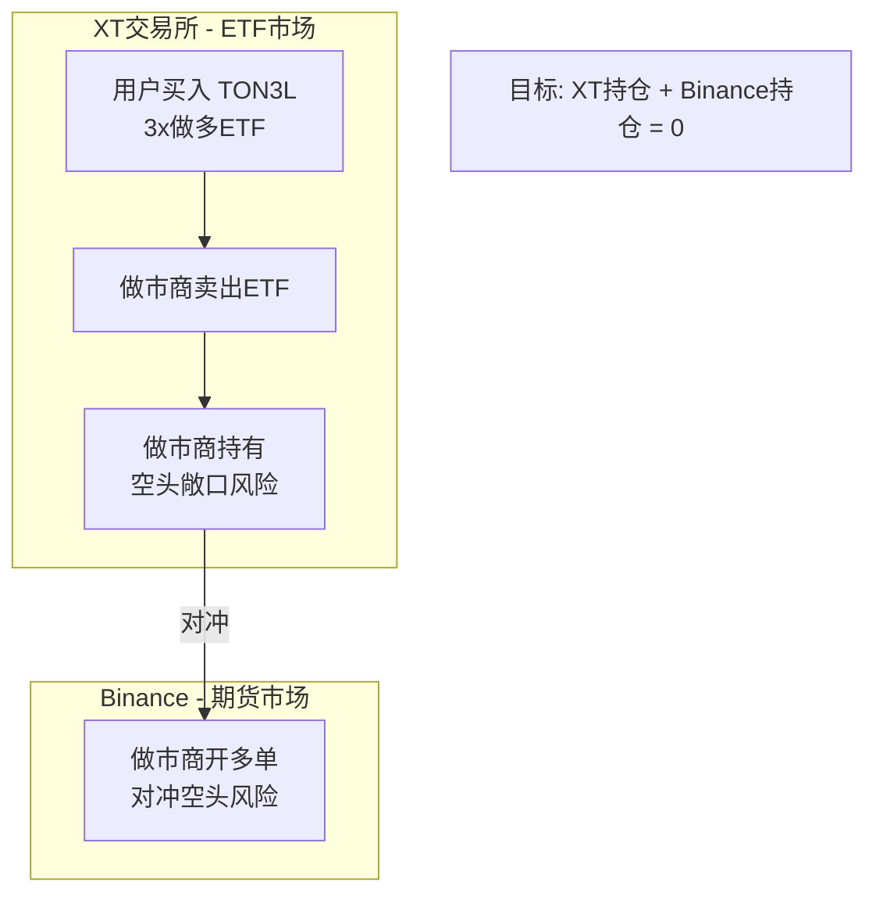
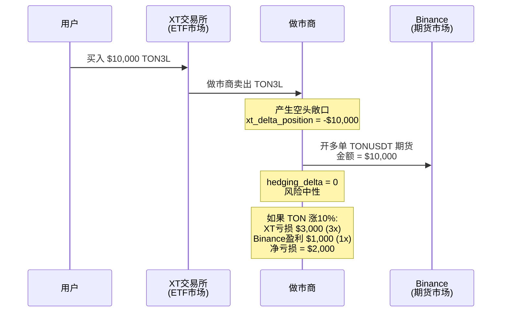
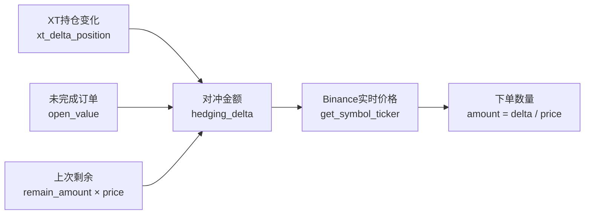
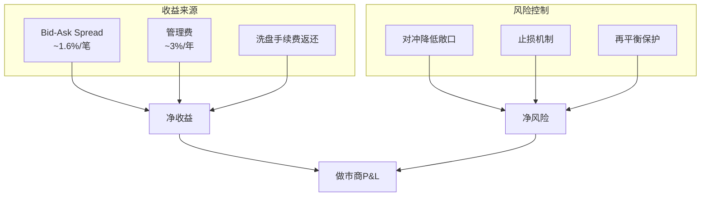

# ETF 做市系统对冲机制详解

本文档详细说明 XT ETF 做市系统的对冲机制、价格计算、滑点分析和收益模型。

---

## 目录

1. [为什么需要对冲](#1-为什么需要对冲)
2. [对冲价格计算](#2-对冲价格计算)
3. [滑点分析](#3-滑点分析)
4. [对冲能否完全弥补亏损](#4-对冲能否完全弥补亏损)
5. [做市商真实盈利模式](#5-做市商真实盈利模式)
6. [代码实现](#6-代码实现)

---

## 1. 为什么需要对冲

### 1.1 做市商角色导致被动持仓

```
用户行为          做市商被动持仓
─────────────     ─────────────────
买入 3x 做多 ETF  →  做市商卖出 = 空头敞口
卖出 3x 做多 ETF  →  做市商买入 = 多头敞口
买入 3x 做空 ETF  →  做市商卖出 = 多头敞口（因为卖出做空=看多）
卖出 3x 做空 ETF  →  做市商买入 = 空头敞口
```

做市商的工作是**提供流动性**，必须承接用户的对手盘，这会产生**非主动的方向性风险**。

### 1.2 杠杆放大风险

这是 **3x/5x 杠杆 ETF**，风险被放大：

```python
# 例如：做市商持有 $10,000 空头敞口
# 如果标的涨 10%：

普通资产亏损: $10,000 × 10% = $1,000
3x ETF 亏损:  $10,000 × 10% × 3 = $3,000  # 亏损放大3倍
5x ETF 亏损:  $10,000 × 10% × 5 = $5,000  # 亏损放大5倍
```

### 1.3 对冲流程图



### 1.4 对冲时序图



---

## 2. 对冲价格计算

### 2.1 价格来源

对冲价格是 **Binance 的实时市场价**，不是 XT 的 ETF 价格。

```python
# hedging.py:145-147
# 从Binance获取实时价格
price = round(float(self.client.get_symbol_ticker(
    symbol=config["bnsymbol"]
)['price']), config["precision_price"])
```

### 2.2 对冲金额计算

```python
# hedging.py:148-150
hedging_delta = xt_delta_position + open_value + self.remain_amount * price 
amount_orig = hedging_delta / price
side = "BUY" if amount_orig < 0 else "SELL"  # 反向操作
```

### 2.3 计算流程图



### 2.4 变量说明

| 变量 | 含义 | 示例 |
|------|------|------|
| `xt_delta_position` | XT端持仓变化金额 | -$10,000 (卖出) |
| `open_value` | Binance未成交订单价值 | $500 |
| `remain_amount` | 上次未对冲的数量 | 0.5 TON |
| `price` | Binance实时价格 | $2.5 |
| `hedging_delta` | 需要对冲的总金额 | -$9,250 |
| `amount_orig` | 需要下单的数量 | 3700 TON |

---

## 3. 滑点分析

### 3.1 滑点产生的三个环节

```
┌─────────────────────────────────────────────────────────────────┐
│                      滑点产生的三个环节                           │
├─────────────────────────────────────────────────────────────────┤
│                                                                 │
│  ① XT成交价 vs ETF净值                                          │
│     用户买入ETF的价格 ≠ 理论净值（做市商的bid/ask spread）         │
│                                                                 │
│  ② ETF净值 vs 标的价格                                          │
│     3x ETF净值 ≠ 3 × 标的现货价格（存在跟踪误差）                  │
│                                                                 │
│  ③ Binance对冲执行滑点                                          │
│     限价单可能不成交，市价单有滑点                                │
│                                                                 │
└─────────────────────────────────────────────────────────────────┘
```

### 3.2 代码中的滑点处理

**使用限价单（可能不成交）：**

```python
# hedging.py:105-119
def create_order(self, symbol, side, price, amount):
    res = self.client.futures_create_order(
        symbol=symbol,
        side=side,
        type="LIMIT",       # ⚠️ 限价单，不保证成交
        price=price,
        quantity=amount,
        timeinforce="GTC"   # Good Till Cancel
    )
```

**剩余量跟踪（下次继续对冲）：**

```python
# hedging.py:73-75
self.remain_value = -1 * (abs(hedging_delta) - self.hedging_value) ...
self.remain_amount = -1 * (amount_orig - amount) ...
```

### 3.3 滑点缓解措施

| 措施 | 说明 |
|------|------|
| `remain_amount` 追踪 | 未完成的对冲下次循环继续 |
| 定期轮询 | `Hedging_interval` 配置对冲检查间隔 |
| 订单状态检查 | `check_open_orders()` 检查未成交订单 |
| 最小数量过滤 | `amount >= 0.001` 过滤小额避免手续费浪费 |

---

## 4. 对冲能否完全弥补亏损

### 4.1 理论上的完美对冲

```
假设：
- XT用户买入 $10,000 的 3x做多ETF
- 做市商产生 $10,000 空头敞口
- 在Binance开 $10,000 多单对冲

标的涨10%时：
┌──────────────────────────────────────────────────────┐
│  XT端 (做市商卖出3x ETF)                              │
│  亏损 = $10,000 × 10% × 3 = $3,000 ❌                 │
├──────────────────────────────────────────────────────┤
│  Binance端 (做多期货)                                 │
│  盈利 = $10,000 × 10% × (期货杠杆) = ???              │
└──────────────────────────────────────────────────────┘
```

### 4.2 关键问题：杠杆不匹配

```
ETF是3x杠杆，但Binance期货需要多少杠杆？

方案A：1:1 金额对冲（代码实际做法）
  - XT敞口: $10,000 → 涨10% → 亏 $3,000 (3x效应)
  - BN对冲: $10,000 → 涨10% → 赚 $1,000 (1x)
  - 净亏损: $2,000 ❌ 没对冲完全！

方案B：1:3 金额对冲（理论正确）
  - XT敞口: $10,000 → 涨10% → 亏 $3,000
  - BN对冲: $30,000 → 涨10% → 赚 $3,000
  - 净损益: $0 ✅ 完美对冲
```

### 4.3 实际代码的对冲策略

从代码看，**对冲金额 = XT持仓金额**，是 **1:1 对冲**，不是 **1:杠杆倍数** 对冲：

```python
# hedging.py:148-149
hedging_delta = xt_delta_position + open_value + self.remain_amount * price 
amount_orig = hedging_delta / price
# 没有乘以杠杆倍数！
```

### 4.4 对冲效果对比表

| 场景 | 1:1 对冲 | 1:3 对冲 (理论) |
|------|---------|----------------|
| 标的涨10% | 净亏 $2,000 | 净损益 $0 |
| 标的跌10% | 净赚 $2,000 | 净损益 $0 |
| 资金占用 | $10,000 | $30,000 |
| 爆仓风险 | 低 | 高 |

### 4.5 为什么选择 1:1 对冲

1. **资金效率**：1:3 需要 3 倍资金占用
2. **爆仓风险**：高杠杆期货更容易爆仓
3. **风险偏好**：接受部分敞口，换取更低的资金压力
4. **Spread 收入**：做市商通过 bid-ask spread 覆盖部分风险

---

## 5. 做市商真实盈利模式

### 5.1 收益来源

```
做市商真正的盈利模式：

1. Bid-Ask Spread（买卖价差）
   ├─ 买入报价 = 净值 × (1 - 0.8%)
   └─ 卖出报价 = 净值 × (1 + 0.8%)
   → 每笔交易赚 ~1.6% 价差

2. 管理费
   └─ 年化 ~3% 持续扣除

3. 洗盘自成交
   └─ 自己创造交易量，手续费返还

对冲的目的：
├─ 不是为了赚钱
└─ 是为了"不亏大钱"（风控）
   └─ 宁可放弃部分收益，也要控制尾部风险
```

### 5.2 收益与风险平衡图



### 5.3 盈利模型数学分析

假设：
- 日均交易量：$100,000
- Bid-Ask Spread：1.6%
- 管理费年化：3%
- 持仓规模：$500,000

```
日收益计算：
Spread收益 = $100,000 × 1.6% / 2 = $800/天
管理费收益 = $500,000 × 3% / 365 = $41/天
───────────────────────────────────
毛收益 ≈ $841/天

风险敞口（1:1对冲下）：
假设标的日波动 5%，3x ETF 波动 15%
未对冲敞口损益 = $500,000 × 5% × 2 = ±$50,000/天
（2 = 3x杠杆 - 1x对冲）

结论：单边行情下，一天就可能亏掉60天的收益！
```

---

## 6. 代码实现

### 6.1 核心文件

| 文件 | 作用 |
|------|------|
| `hedging.py` | 主对冲逻辑，Hedge 类 |
| `hedging_aggregation.py` | 多策略聚合对冲 |
| `hedging_manual_qa.py` | 手动对冲测试 |

### 6.2 Hedge 类结构

```python
class Hedge():
    def __init__(self):
        # 初始化 Binance 客户端
        self.client = Client(api_key, api_secret)
        self.position = 0           # 累计对冲仓位
        self.remain_amount = 0      # 剩余未对冲数量
        self.remain_value = 0       # 剩余未对冲金额
    
    def run(self, xt_client, config):
        """主循环：定期检查并执行对冲"""
        while True:
            time.sleep(config["Hedging_interval"])
            
            # 1. 获取XT持仓变化
            xt_delta_position, xt_position, ... = xt_client.get_position3(...)
            
            # 2. 计算需要对冲的金额
            hedging_delta = xt_delta_position + open_value + self.remain_amount * price
            
            # 3. 执行对冲下单
            if amount >= 0.001:
                self.create_order(symbol, side, price, amount)
            
            # 4. 检查对冲结果
            self.get_position(...)
    
    def create_order(self, symbol, side, price, amount):
        """在Binance下限价单"""
        self.client.futures_create_order(
            symbol=symbol,
            side=side,
            type="LIMIT",
            price=price,
            quantity=amount,
            timeinforce="GTC"
        )
    
    def get_position(self, ...):
        """检查对冲后的仓位是否平衡"""
        # 目标: xt_position + bn_position == 0
        if xt_position + bn_position == 0:
            logging.info("PRICE IS OK - 完全对冲")
```

### 6.3 配置参数

```yaml
# config/strategies.yaml
Enable_hedging: false      # 是否启用对冲（当前禁用）
Hedging_interval: 60       # 对冲检查间隔（秒）
bnsymbol: "TONUSDT"        # Binance交易对
precision_price: 4         # 价格精度
precision_amount: 2        # 数量精度
leverage: 3                # 期货杠杆倍数
```

### 6.4 对冲状态检查

```python
# hedging.py:91-99
if xt_position + bn_position == 0:
    logging.info(f"PRICE IS OK - xt_position: {xt_position} bn_position: {bn_position}")
    result = True
else:
    if abs(xt_position) > abs(bn_position):
        logging.info(f"PRICE IS NOT OK - xt_position: {xt_position} bn_position: {bn_position}")
        result = False
    else:
        logging.info(f"PRICE IS OK - xt_position: {xt_position} bn_position: {bn_position}")
        result = True
```

---

## 附录

### A. 总结表

| 问题 | 答案 |
|-----|------|
| **为什么需要对冲** | 做市商被动持仓产生方向性风险，杠杆放大亏损 |
| **对冲价格** | Binance 实时 ticker 价格，非 XT ETF 价格 |
| **滑点存在吗** | ✅ 存在：执行延迟、限价单未成交、价格差异 |
| **能完全弥补吗** | ❌ 不能完全：1:1对冲 vs 3x/5x杠杆存在缺口 |
| **实际做法** | 跟踪 `remain_amount`，持续补对冲 |
| **真正盈利** | Spread + 管理费，对冲只是风控手段 |

### B. 核心认知

> **对冲是降低风险的手段，不是盈利的来源。**
> 
> 做市商赚的是 spread 和管理费，对冲只是防止单边行情爆仓。

### C. 相关文档

- [ETF做市系统技术文档](ETF做市系统技术文档.md) - 净值计算、再平衡机制
- [风险控制实施文档](RISK_CONTROL_IMPLEMENTATION.md) - 止损、风控系统
- [项目进度报告](PROJECT_PROGRESS_REPORT.md) - 整体项目状态
